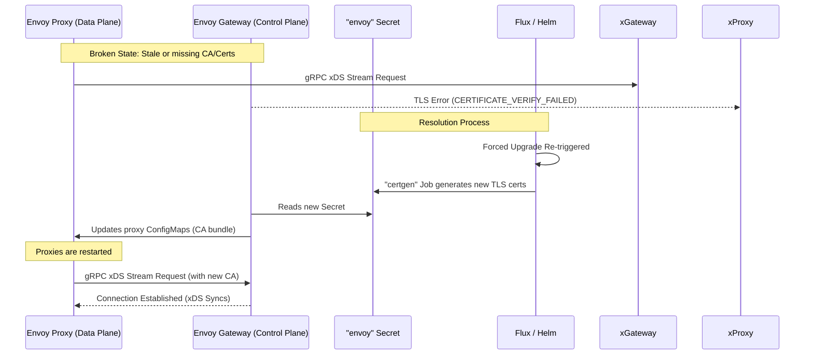

# Fixing Envoy Gateway xDS Cluster TLS Verification Errors

## The Problem
You might notice that your Envoy Gateway data plane proxies (`envoy-internal`, `envoy-external`) are functioning incorrectly or traffic is not routing as expected. When checking the logs of the Envoy proxy containers, you encounter errors indicating a broken gRPC connection to the `xds_cluster` (the Envoy Gateway control plane).

**Symptom in Proxy Logs (`kubectl logs -n network deploy/envoy-internal -c envoy`):**
```text
[warning][config] [./source/extensions/config_subscription/grpc/grpc_stream.h:227] DeltaAggregatedResources gRPC config stream to xds_cluster closed since 421s ago: 14, upstream connect error or disconnect/reset before headers. reset reason: remote connection failure, transport failure reason: TLS_error:|...|CERTIFICATE_VERIFY_FAILED:verify cert failed: X509_verify_cert: certificate verification error at depth 0: unable to get local issuer certificate:...
```

**Symptom in Gateway Controller Logs (`kubectl logs -n network deploy/envoy-gateway`):**
```text
ERROR   gateway-api     runner/runner.go:220    errors detected during translation      {"gateway-class": "envoy", "error": "envoy TLS secret network/envoy not found"}
```

## Root Cause
This issue occurs when the Envoy proxies cannot authenticate the TLS certificate presented by the Envoy Gateway control plane.

In standard deployments via the official Helm chart, the control-plane TLS certificates (stored in the `envoy` Secret) are not dynamically regenerated by the controller at runtime. Instead, they are generated once during the Helm installation/upgrade process using a batch Job (`envoy-gateway-gateway-helm-certgen`).

If this `envoy` TLS Secret is manually deleted, expires, or if the ConfigMaps mounted by the proxies get out of sync with the Gateway controller, the proxies will fail to verify the connection and reject the control plane. Simply restarting the Envoy Gateway controller pod is insufficient because it does not recreate the missing Secret.

### Communication Flow & Resolution


## Step-by-Step Fix

Follow these steps to force the recreation of the control-plane certificates and synchronize the proxies.

### 1. Delete Stale ConfigMaps and Secrets
First, clear out the existing mismatched state to force the controller and Helm to start fresh.
```bash
# Delete the missing or stale Envoy TLS Secret
kubectl delete secret -n network envoy

# Delete the CA ConfigMaps mounted by the proxies
kubectl delete configmap -n network envoy-internal envoy-external
```

### 2. Force Helm to Regenerate the Certificates
Because the certificates are generated by a Helm hook job, we must force Flux to perform a full Helm upgrade, which runs the `certgen` job.
```bash
# Force a reconciliation and upgrade via Flux
flux reconcile hr -n network envoy-gateway --force
```

### 3. Verify the `certgen` Job
Wait a moment and verify that the `envoy-gateway-gateway-helm-certgen` job runs and completes.
```bash
kubectl get jobs -n network
kubectl get secret -n network envoy
```
*You should now see the `envoy` secret has been created.*

### 4. Restart the Envoy Components
Now that the valid TLS secret exists, restart the Envoy Gateway controller so it reads the new secret and provisions the ConfigMaps for the proxies.
```bash
kubectl rollout restart deploy -n network envoy-gateway
```

Wait a few seconds for the controller to start, then restart the proxy deployments so they mount the freshly generated CA ConfigMaps.
```bash
kubectl rollout restart deploy -n network envoy-internal envoy-external
```

### 5. Validate the Fix
Check the logs of the newly spawned Envoy proxy pods. They should no longer report `CERTIFICATE_VERIFY_FAILED` and should connect smoothly to the `xds_cluster`.
```bash
kubectl logs -n network deploy/envoy-internal -c envoy --tail=50 | grep xds
```
