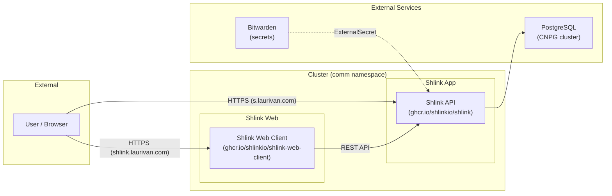

# Shlink

Self-hosted URL shortener running at [https://s.laurivan.com](https://s.laurivan.com), with a web management interface at [https://shlink.laurivan.com](https://shlink.laurivan.com).

## What It Does

Shlink is a URL shortener that lets you create short links, track visits with analytics, manage tags, and use custom domains. It exposes a REST API that the web client connects to for management.

## Architecture



## Components

| Component | Purpose |
|-----------|---------|
| **Shlink** | URL shortener API server (handles redirects, REST API, visit tracking) |
| **Shlink Web Client** | Management UI (create/edit short URLs, view analytics) |
| **PostgreSQL (CNPG)** | Database backend via shared postgres-cluster |

## Endpoints

| Service | Hostname | Gateway | Access |
|---------|----------|---------|--------|
| Shlink API | `s.laurivan.com` | envoy-external | Public (short URL redirects + API) |
| Shlink Web | `shlink.laurivan.com` | envoy-internal | Internal only (management UI) |

## Integration

The web client connects to the Shlink API server. On first launch of the web UI:

1. Open `https://shlink.laurivan.com`
2. The server is pre-configured via env vars (`SHLINK_SERVER_URL=https://s.laurivan.com`)
3. Enter the API key (the `INITIAL_API_KEY` from the Bitwarden secret) to authenticate

The web client env vars `SHLINK_SERVER_URL` and `SHLINK_SERVER_NAME` pre-populate the server entry in the UI so you only need to provide the API key.

### API Usage

You can also use the REST API directly:

```bash
# Create a short URL
curl -X POST https://s.laurivan.com/rest/v3/short-urls \
  -H "X-Api-Key: <INITIAL_API_KEY>" \
  -H "Content-Type: application/json" \
  -d '{"longUrl": "https://example.com/very-long-url"}'

# List short URLs
curl https://s.laurivan.com/rest/v3/short-urls \
  -H "X-Api-Key: <INITIAL_API_KEY>"
```

## Secrets

All secrets are stored in a **Bitwarden item** named `shlink` and synced via ExternalSecret (ClusterSecretStore: `bitwarden`).

### Required Bitwarden Fields

| Field | Usage | How to Obtain |
|-------|-------|---------------|
| `INITIAL_API_KEY` | API key for the Shlink REST API (used by web client and external integrations) | Generate a random string: `openssl rand -base64 32` |
| `DB_USER` | PostgreSQL username | Create a role on the CNPG cluster (see Database section) |
| `DB_PASSWORD` | PostgreSQL password | Set when creating the DB role |
| `GEOLITE_LICENSE_KEY` | (Optional) MaxMind GeoLite2 license for visit geolocation | Free account at [maxmind.com](https://www.maxmind.com/en/geolite2/signup) |

## Database

Shlink connects to the shared **CNPG PostgreSQL cluster** (`postgres-cluster-rw.database.svc.cluster.local`) using password-based authentication.

> **Note**: The CNPG component is not used here because Shlink does not support mTLS certificate-based PostgreSQL connections. Instead, credentials are provided via the Bitwarden secret.

### Setup

Create the database and role on the CNPG cluster:

```sql
CREATE ROLE shlink WITH LOGIN PASSWORD '<password>';
CREATE DATABASE shlink OWNER shlink;
```

You can do this via pgAdmin (`pgadmin.laurivan.com`) or by exec-ing into the postgres pod:

```bash
kubectl exec -it -n database postgres-cluster-1 -- psql -U postgres
```

Then store the credentials (`DB_USER=shlink`, `DB_PASSWORD=<password>`) in the Bitwarden item.

## Dependencies

- `postgres-cluster` (database namespace) — PostgreSQL backend
- `bitwarden` ClusterSecretStore — secret management
- `envoy-external` Gateway — public ingress for short URLs
- `envoy-internal` Gateway — internal ingress for web management UI

## Flux Kustomizations

| Name | Path | Depends On |
|------|------|------------|
| `shlink` | `./kubernetes/apps/comm/shlink/app` | `postgres-cluster` |
| `shlink-web` | `./kubernetes/apps/comm/shlink/web` | `shlink` |

Both deploy to the `comm` namespace.
