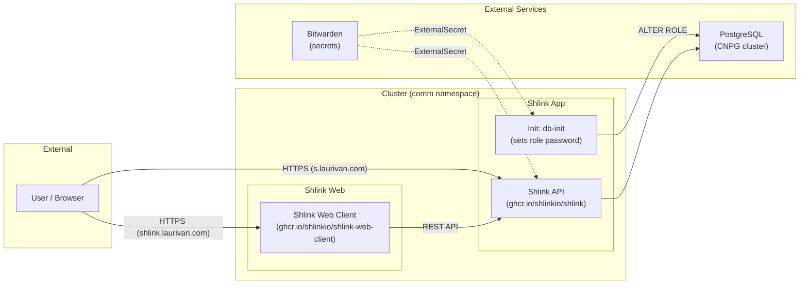

# Shlink

Self-hosted URL shortener running at [https://s.laurivan.com](https://s.laurivan.com), with a web management interface at [https://shlink.laurivan.com](https://shlink.laurivan.com).

## What It Does

Shlink is a URL shortener that lets you create short links, track visits with analytics, manage tags, and use custom domains. It exposes a REST API that the web client connects to for management.

## Architecture



## Components

| Component | Purpose |
|-----------|---------|
| **Shlink** | URL shortener API server (handles redirects, REST API, visit tracking) |
| **Shlink Web Client** | Management UI (create/edit short URLs, view analytics) |
| **db-init** (init container) | Sets the PostgreSQL role password on each startup (idempotent) |
| **PostgreSQL (CNPG)** | Database backend via shared postgres-cluster |

## Endpoints

| Service | Hostname | Gateway | Access |
|---------|----------|---------|--------|
| Shlink API | `s.laurivan.com` | envoy-external | Public (short URL redirects + API) |
| Shlink Web | `shlink.laurivan.com` | envoy-internal | Internal only (management UI) |

## Deployment Flow

The deployment is fully automated — no manual database steps required:

1. **Set secrets in Bitwarden** (item: `shlink`) with `INITIAL_API_KEY` and `DB_PASSWORD`
2. **Push/merge** the manifests — Flux deploys everything
3. **CNPG component** creates the `shlink` database and role (no password yet)
4. **Init container** (`db-init`) connects as superuser and sets the role password from Bitwarden
5. **Shlink** starts and connects using the same `DB_PASSWORD`

No manual intervention needed between steps.

## Integration

The web client connects to the Shlink API server. On first launch of the web UI:

1. Open `https://shlink.laurivan.com`
2. The server is pre-configured via env vars (`SHLINK_SERVER_URL=https://s.laurivan.com`)
3. Enter the API key (the `INITIAL_API_KEY` from the Bitwarden secret) to authenticate

### API Usage

```bash
# Create a short URL
curl -X POST https://s.laurivan.com/rest/v3/short-urls \
  -H "X-Api-Key: <INITIAL_API_KEY>" \
  -H "Content-Type: application/json" \
  -d '{"longUrl": "https://example.com/very-long-url"}'

# List short URLs
curl https://s.laurivan.com/rest/v3/short-urls \
  -H "X-Api-Key: <INITIAL_API_KEY>"
```

## Secrets

### Bitwarden Item: `shlink`

| Field | Usage | How to Obtain |
|-------|-------|---------------|
| `INITIAL_API_KEY` | API key for the Shlink REST API | `openssl rand -base64 32` |
| `DB_PASSWORD` | PostgreSQL password for the `shlink` role | `openssl rand -base64 24` |
| `GEOLITE_LICENSE_KEY` | (Optional) MaxMind GeoLite2 for visit geolocation | [maxmind.com](https://www.maxmind.com/en/geolite2/signup) |

### Bitwarden Item: `cloudnative_pg` (shared, already exists)

| Field | Usage |
|-------|-------|
| `POSTGRES_SUPER_USER` | Superuser name (used by init container to ALTER ROLE) |
| `POSTGRES_SUPER_PASS` | Superuser password |

### Generated Kubernetes Secrets

| Secret Name | Source | Used By |
|-------------|--------|---------|
| `shlink` | Bitwarden `shlink` | Shlink app + init container (`DB_PASSWORD`, `INITIAL_API_KEY`) |
| `shlink-pginit` | Bitwarden `cloudnative_pg` | Init container (`PGUSER`, `PGPASSWORD` for superuser access) |
| `shlink-postgres` | CNPG component | Not used (mTLS URL — Shlink uses password auth instead) |

## Database

The **CNPG component** (`components/cnpg/app`) declaratively provisions:
- A `shlink` database on the shared `postgres-cluster`
- A `shlink` role as the database owner

The **init container** (`db-init`) then:
- Connects as the postgres superuser
- Runs `ALTER ROLE shlink WITH PASSWORD '<DB_PASSWORD>'`
- This is idempotent — safe to run on every pod restart

Shlink connects with:
- `DB_DRIVER=postgres`
- `DB_HOST=postgres-cluster-rw.database.svc.cluster.local`
- `DB_PORT=5432`
- `DB_NAME=shlink`
- `DB_USER=shlink`
- `DB_PASSWORD` → from Bitwarden

## Dependencies

- `postgres-cluster` (database namespace) — PostgreSQL backend
- `cnpg` (database namespace) — CNPG operator for DB provisioning
- `bitwarden` ClusterSecretStore — secret management
- `envoy-external` Gateway — public ingress for short URLs
- `envoy-internal` Gateway — internal ingress for web management UI

## Flux Kustomizations

| Name | Path | Depends On |
|------|------|------------|
| `shlink` | `./kubernetes/apps/comm/shlink/app` | `postgres-cluster` |
| `shlink-db` | `./kubernetes/components/cnpg/app/database` | `cnpg` (auto-created by component) |
| `shlink-web` | `./kubernetes/apps/comm/shlink/web` | `shlink` |
