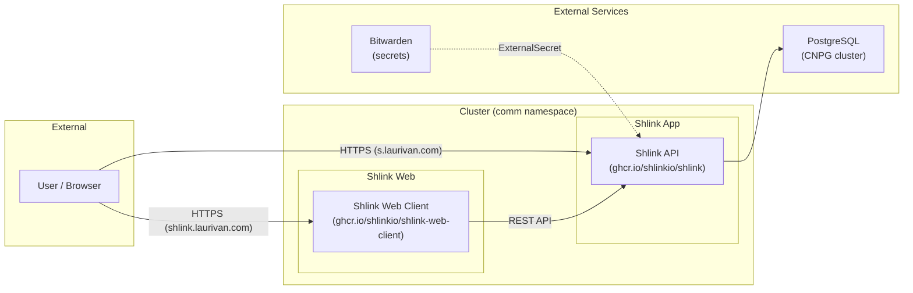

# Shlink

Self-hosted URL shortener running at [https://s.laurivan.com](https://s.laurivan.com), with a web management interface at [https://shlink.laurivan.com](https://shlink.laurivan.com).

## What It Does

Shlink is a URL shortener that lets you create short links, track visits with analytics, manage tags, and use custom domains. It exposes a REST API that the web client connects to for management.

## Architecture



## Components

| Component | Purpose |
|-----------|---------|
| **Shlink** | URL shortener API server (handles redirects, REST API, visit tracking) |
| **Shlink Web Client** | Management UI (create/edit short URLs, view analytics) |
| **PostgreSQL (CNPG)** | Database backend via shared postgres-cluster |

## Endpoints

| Service | Hostname | Gateway | Access |
|---------|----------|---------|--------|
| Shlink API | `s.laurivan.com` | envoy-external | Public (short URL redirects + API) |
| Shlink Web | `shlink.laurivan.com` | envoy-internal | Internal only (management UI) |

## Integration

The web client connects to the Shlink API server. On first launch of the web UI:

1. Open `https://shlink.laurivan.com`
2. The server is pre-configured via env vars (`SHLINK_SERVER_URL=https://s.laurivan.com`)
3. Enter the API key (the `INITIAL_API_KEY` from the Bitwarden secret) to authenticate

The web client env vars `SHLINK_SERVER_URL` and `SHLINK_SERVER_NAME` pre-populate the server entry in the UI so you only need to provide the API key.

### API Usage

You can also use the REST API directly:

```bash
# Create a short URL
curl -X POST https://s.laurivan.com/rest/v3/short-urls \
  -H "X-Api-Key: <INITIAL_API_KEY>" \
  -H "Content-Type: application/json" \
  -d '{"longUrl": "https://example.com/very-long-url"}'

# List short URLs
curl https://s.laurivan.com/rest/v3/short-urls \
  -H "X-Api-Key: <INITIAL_API_KEY>"
```

## Secrets

All secrets are stored in a **Bitwarden item** named `shlink` and synced via ExternalSecret (ClusterSecretStore: `bitwarden`).

### Required Bitwarden Fields

| Field | Usage | How to Obtain |
|-------|-------|---------------|
| `INITIAL_API_KEY` | API key for the Shlink REST API (used by web client and external integrations) | Generate a random string: `openssl rand -base64 32` |
| `DB_PASSWORD` | PostgreSQL password for the `shlink` role | Set via pgAdmin after CNPG creates the role (see Database section) |
| `GEOLITE_LICENSE_KEY` | (Optional) MaxMind GeoLite2 license for visit geolocation | Free account at [maxmind.com](https://www.maxmind.com/en/geolite2/signup) |

### Auto-generated Resources (CNPG component)

| Resource | Type | Purpose |
|----------|------|---------|
| `postgres-shlink` | Database CR | Ensures `shlink` database + `shlink` owner role exist |
| `postgres-shlink-cert` | Certificate | mTLS client cert (created but unused by Shlink) |
| `shlink-postgres` | Secret | Connection URL with mTLS (created but unused by Shlink) |

> **Note**: The CNPG component creates the mTLS cert and URL secret as part of its standard flow. Shlink does not use these because it connects via password auth with individual env vars (`DB_USER`, `DB_PASSWORD`, `DB_HOST`, etc.). The cert and URL secret are harmless overhead that keep the deployment pattern consistent with other apps.

## Database

The **CNPG component** (`components/cnpg/app`) declaratively provisions:
- A `shlink` database on the shared `postgres-cluster`
- A `shlink` role as the database owner

Shlink connects using password authentication (not mTLS). After initial deployment:

1. The CNPG operator creates the database and role automatically
2. Set a password on the role via pgAdmin (`pgadmin.laurivan.com`) or kubectl:
   ```bash
   kubectl port-forward -n database svc/postgres-cluster-rw 5432:5432
   psql -h localhost -U postgres -c "ALTER ROLE shlink WITH PASSWORD '<password>';"
   ```
3. Store the password as `DB_PASSWORD` in the Bitwarden item `shlink`

The connection details are set as plain env vars in the HelmRelease:
- `DB_DRIVER=postgres`
- `DB_HOST=postgres-cluster-rw.database.svc.cluster.local`
- `DB_PORT=5432`
- `DB_NAME=shlink`
- `DB_USER=shlink`
- `DB_PASSWORD` → from Bitwarden secret

## Dependencies

- `postgres-cluster` (database namespace) — PostgreSQL backend
- `cnpg` (database namespace) — CNPG operator for DB provisioning
- `bitwarden` ClusterSecretStore — secret management
- `envoy-external` Gateway — public ingress for short URLs
- `envoy-internal` Gateway — internal ingress for web management UI

## Flux Kustomizations

| Name | Path | Depends On |
|------|------|------------|
| `shlink` | `./kubernetes/apps/comm/shlink/app` | `postgres-cluster` |
| `shlink-db` | `./kubernetes/components/cnpg/app/database` | `cnpg` (auto-created by component) |
| `shlink-web` | `./kubernetes/apps/comm/shlink/web` | `shlink` |

Both app kustomizations deploy to the `comm` namespace. The DB kustomization deploys to `database`.
