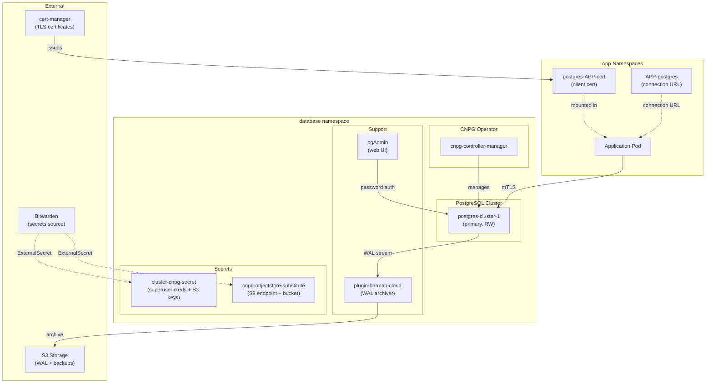

# CloudNative-PG (CNPG)

Shared PostgreSQL cluster for the homelab, managed by the [CloudNative-PG operator](https://cloudnative-pg.io/).

## What It Does

CNPG provides a production-grade PostgreSQL cluster as a Kubernetes-native resource. It handles:

- Automated failover and switchover
- Continuous WAL archiving to S3 (via Barman Cloud plugin)
- Scheduled backups with retention policies
- Declarative database and role provisioning
- mTLS certificate management for secure client connections
- Bootstrap from S3 backup (disaster recovery)

## Architecture



## Components

| Component | Purpose | Flux Kustomization |
|-----------|---------|-------------------|
| **CNPG CRDs** | Custom Resource Definitions for the operator | `cnpg-crds` |
| **CNPG Operator** | Manages PostgreSQL cluster lifecycle | `cnpg` |
| **Barman Cloud Plugin** | WAL archiving and backup to S3 | `plugin-barman-cloud` |
| **Postgres Cluster** | The actual PostgreSQL instance | `postgres-cluster` |
| **pgAdmin** | Web-based database management UI | `pgadmin` |

## Configuration

The cluster is configured for a resource-constrained homelab environment:

| Parameter | Value | Default |
|-----------|-------|---------|
| Replicas | 1 | 2 |
| Storage | 5Gi (openebs-hostpath) | 2Gi |
| Memory limit | 512Mi | 2Gi |
| CPU request | 100m | 500m |
| PostgreSQL version | 18.3 | — |
| Max connections | 600 | — |
| Shared buffers | 128MB | — |

### Extensions

- **vchord** — Vector similarity search (pg18 compatible)

### pg_hba Rules

```
hostnossl all all 10.69.0.0/16    scram-sha-256   # cluster pods (password, no SSL)
hostnossl all all fc69::/16       scram-sha-256   # cluster pods IPv6
hostssl   all all all             cert            # external (mTLS required)
```

This means:
- **In-cluster connections** (from pod CIDRs) can use password auth without SSL
- **External/cross-namespace connections** over SSL require a valid client certificate

## Secrets

### Bitwarden Item: `cloudnative_pg`

| Field | Usage |
|-------|-------|
| `POSTGRES_SUPER_USER` | Superuser username |
| `POSTGRES_SUPER_PASS` | Superuser password |
| `AWS_ACCESS_KEY_ID` | S3 access key for backups |
| `AWS_SECRET_ACCESS_KEY` | S3 secret key for backups |
| `S3_POSTGRES_STORAGE` | S3 endpoint URL |
| `S3_POSTGRES_BUCKET` | S3 bucket name |

### Generated Kubernetes Secrets

| Secret | Namespace | Contents |
|--------|-----------|----------|
| `cluster-cnpg-secret` | database | Superuser creds + S3 keys |
| `cnpg-objectstore-substitute` | database | S3 endpoint/bucket for postBuild substitution |
| `postgres-cluster-ca-secret` | database | CA certificate (root of trust) |
| `postgres-cluster-server-cert` | database | Server TLS cert (server auth) |
| `postgres-cluster-client-cert` | database | Replication client cert |

## Per-App Database Provisioning

Apps integrate with CNPG via reusable components in `kubernetes/components/cnpg/`:

### `components/cnpg/app` (for apps with their own chart)

Creates:
- A `Database` CR (provisions DB + owner role)
- A `Certificate` (mTLS client cert for the role)
- A `Secret` with full connection URL (mTLS)
- A Flux Kustomization targeting the `database` namespace

### `components/cnpg/app-template` (for apps using bjw-s app-template)

Same as above, plus patches the HelmRelease to mount postgres certs at `/var/run/secrets/postgresql`.

### Usage in app.ks.yaml

```yaml
spec:
  components:
    - ../../../../components/cnpg/app-template  # or cnpg/app
  dependsOn:
    - name: postgres-cluster
      namespace: database
  postBuild:
    substitute:
      APP: my-app  # becomes DB name, role name, and cert CN
```

The app then references the connection URL:
```yaml
env:
  DATABASE_URL:
    valueFrom:
      secretKeyRef:
        name: "{{ .Release.Name }}-postgres"
        key: url
```

### Managed Roles

Roles are declared in `cluster.yaml` under `managed.roles`:

| Role | Password | Used By |
|------|----------|---------|
| `atuin` | disabled (cert only) | Atuin |
| `authentik` | disabled (cert only) | Authentik |
| `immich` | disabled (cert only) | Immich |
| `paperless` | disabled (cert only) | Paperless |
| `sure-am` | disabled (cert only) | Sure-AM |

> **Note**: Some apps (like Shlink) that can't use mTLS connect via password auth using credentials from their own Bitwarden secret. These roles need their password set separately (e.g. via an init container).

## Backups

| Type | Schedule | Retention | Target |
|------|----------|-----------|--------|
| WAL archiving | Continuous | 30 days | S3 |
| Full backup | Daily (`@daily`) | 30 days | S3 (Barman plugin) |

Bootstrap is configured to recover from S3, enabling disaster recovery from a complete cluster loss.

## Endpoints

| Service | Hostname | Gateway | Access |
|---------|----------|---------|--------|
| pgAdmin | `pg.laurivan.com` | envoy-internal | Internal only |

## Flux Kustomizations

| Name | Path | Depends On |
|------|------|------------|
| `cnpg-crds` | `./kubernetes/apps/database/cnpg/crds` | — |
| `cnpg` | `./kubernetes/apps/database/cnpg/app` | — |
| `plugin-barman-cloud` | `./kubernetes/apps/database/cnpg/plugin-barman-cloud` | — |
| `postgres-cluster` | `./kubernetes/apps/database/cnpg/cluster` | `cnpg-crds`, `openebs` |
| `pgadmin` | `./kubernetes/apps/database/cnpg/pgadmin` | — |

## Connecting pgAdmin (Local Desktop) to the Cluster

The in-cluster pgAdmin at `pg.laurivan.com` is pre-configured with superuser credentials. To connect a **local pgAdmin** on your PC:

### Option 1: Password Auth via Port-Forward (simplest)

Since `pg_hba` allows password auth from the cluster CIDR (`10.69.0.0/16`), port-forwarding routes your traffic through the cluster network:

```bash
kubectl port-forward -n database svc/postgres-cluster-rw 5432:5432
```

Then in pgAdmin:
- Host: `localhost`
- Port: `5432`
- Username/Password: from Bitwarden item `cloudnative_pg` (`POSTGRES_SUPER_USER` / `POSTGRES_SUPER_PASS`)
- SSL mode: `Prefer` or `Disable`

### Option 2: mTLS with Client Certificate (direct connection)

If connecting directly to the cluster IP (not via port-forward), you need a client certificate because `pg_hba` requires `cert clientcert=verify-full` for SSL connections outside the cluster CIDR.

#### 1. Extract the client certificate

Generate a client cert for your user (or use the superuser cert):

```bash
# Extract CA cert (needed for server verification)
kubectl get secret -n database postgres-cluster-server-cert \
  -o jsonpath='{.data.ca\.crt}' | base64 -d > ca.crt

# Option A: Create a new client cert via cert-manager
# (requires a Certificate resource targeting postgres-cluster-client-ca-issuer)

# Option B: Extract an existing app's client cert (e.g. atuin)
kubectl get secret -n development postgres-atuin-cert \
  -o jsonpath='{.data.tls\.crt}' | base64 -d > client.crt
kubectl get secret -n development postgres-atuin-cert \
  -o jsonpath='{.data.tls\.key}' | base64 -d > client.key
chmod 600 client.key
```

#### 2. Configure pgAdmin

In pgAdmin connection settings:
- Host: cluster node IP or LoadBalancer IP
- Port: `5432`
- Username: must match the `commonName` in the client cert (e.g. `atuin`)
- SSL mode: `verify-full`
- SSL tab:
  - Client certificate: `client.crt`
  - Client certificate key: `client.key`
  - Root certificate: `ca.crt`

#### 3. Create a dedicated admin client cert (recommended)

For a personal admin cert, create a Certificate resource:

```yaml
apiVersion: cert-manager.io/v1
kind: Certificate
metadata:
  name: postgres-admin-cert
  namespace: database
spec:
  secretName: postgres-admin-cert
  usages:
    - client auth
  commonName: postgres  # must match the superuser role name
  issuerRef:
    name: postgres-cluster-client-ca-issuer
    kind: ClusterIssuer
    group: cert-manager.io
```

Then extract:
```bash
kubectl get secret -n database postgres-admin-cert \
  -o jsonpath='{.data.tls\.crt}' | base64 -d > admin.crt
kubectl get secret -n database postgres-admin-cert \
  -o jsonpath='{.data.tls\.key}' | base64 -d > admin.key
chmod 600 admin.key
```

> **Tip**: For day-to-day use, Option 1 (port-forward + password) is the most practical. Option 2 is needed if you want to connect without port-forwarding (e.g. from a machine on the same network with direct access to the cluster nodes).
