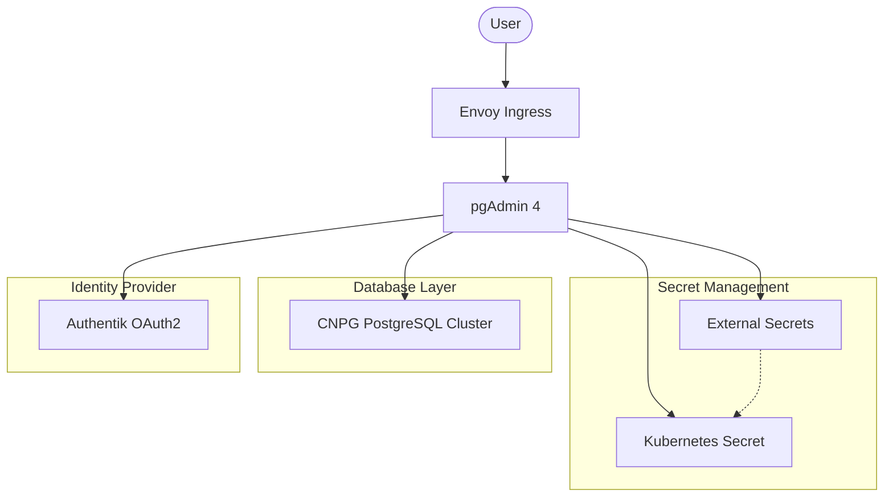

# pgAdmin 4

[pgAdmin](https://www.pgadmin.org/) is the most popular and feature-rich Open Source administration and development platform for PostgreSQL. In this stack, it is configured to provide a web interface for managing the CloudNativePG (CNPG) clusters.

## 🔗 Relationships & Architecture

The following diagram illustrates how pgAdmin interacts with other components in the cluster:



## 📋 Prerequisites

Before deploying pgAdmin, ensure the following prerequisites are met:

### 1. External Secrets (Bitwarden)
pgAdmin requires several secrets managed via `ExternalSecret`. These are pulled from Bitwarden:
- **`PGADMIN_DEFAULT_EMAIL`**: Initial admin email.
- **`PGADMIN_DEFAULT_PASSWORD`**: Initial admin password.
- **`PGADMIN_CLIENT_ID`**: OAuth2 Client ID from Authentik.
- **`PGADMIN_CLIENT_SECRET`**: OAuth2 Client Secret from Authentik.
- **`POSTGRES_SUPER_USER`**: Superuser username for the CNPG cluster.
- **`POSTGRES_SUPER_PASS`**: Superuser password for the CNPG cluster.

#### Bitwarden Item Examples

**Key: `pgadmin`**
```json
{
  "PGADMIN_DEFAULT_EMAIL": "admin@example.com",
  "PGADMIN_DEFAULT_PASSWORD": "securepassword",
  "PGADMIN_CLIENT_ID": "xxxxxxxxxxxxxxxxxxxx",
  "PGADMIN_CLIENT_SECRET": "xxxxxxxxxxxxxxxxxxxxxxxxxxxxxxxx"
}
```

**Key: `cloudnative_pg`**
```json
{
  "POSTGRES_SUPER_USER": "postgres",
  "POSTGRES_SUPER_PASS": "anothersecurepassword"
}
```

### 2. CloudNativePG (CNPG) Cluster
A running CNPG cluster must be available. pgAdmin is configured to connect to `postgres-cluster-rw.database.svc.cluster.local`. Ensure the `cloudnative_pg` Bitwarden key contains the necessary credentials.

### 3. Authentik (OAuth2)
This deployment uses Authentik for SSO. You must have an application and provider configured in Authentik with the following settings:
- **Redirect URI**: `https://pg.laurivan.com/oauth2/authorize`
- **Scopes**: `openid`, `email`, `profile`

## ⚙️ Configuration Details

### OAuth2 Integration
Authentication is primarily handled via OAuth2 (`config_local.py`). Internal authentication is currently commented out in favor of Authentik.

### Auto-Discovery of Servers
The `servers.json` file is pre-configured to automatically add the `postgres-cluster` to the pgAdmin interface for all users.

### Persistent Storage
User settings and preferences are stored in a persistent volume mounted at `/var/lib/pgadmin`.

### .pgpass Management
An init container is used to copy the superuser credentials into each user's storage directory to enable seamless connection to the database without re-entering passwords.

## 🚀 Deployment

The deployment is managed via Flux CD using the `app-template` Helm chart.

```bash
# To trigger a manual reconciliation
flux reconcile kustomization pgadmin -n flux-system
```
