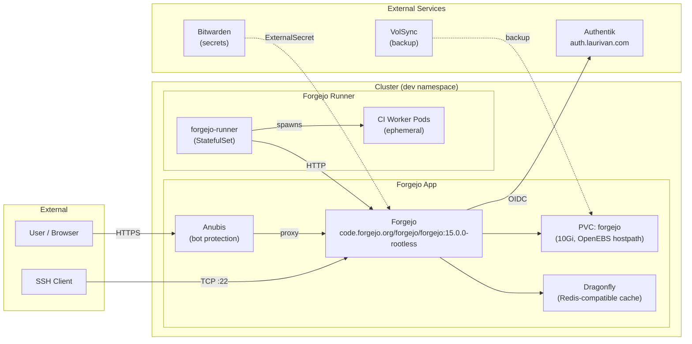

# Forgejo

Self-hosted Git forge running at [https://git.laurivan.com](https://git.laurivan.com).

## Architecture

## Components

| Component | Purpose |
|-----------|---------|
| **Forgejo** | Git forge (web UI, API, SSH) |
| **Anubis** | Bot/scraper protection proxy in front of Forgejo HTTP |
| **Dragonfly** | Redis-compatible in-memory store for cache, sessions, and queues |
| **Forgejo Runner** | CI/CD runner (Kubernetes executor, spawns job pods in `dev` namespace) |
| **VolSync** | PVC backup (10Gi OpenEBS hostpath volume) |

## Endpoints

| Protocol | Hostname | Gateway | Port |
|----------|----------|---------|------|
| HTTPS | `git.laurivan.com` | envoy-external | 443 |
| SSH | `git.laurivan.com` | envoy-external (TCPRoute) | 22 |

## Authentication

Forgejo uses **Authentik** as its sole authentication provider via OpenID Connect. Internal sign-in and registration are disabled.

- **Provider**: OpenID Connect
- **Discovery URL**: `https://auth.laurivan.com/application/o/forgejo/.well-known/openid-configuration`
- **Admin group claim**: `forgejo_admins`
- **Scopes**: `openid email profile groups`

### Authentik Setup

1. In Authentik, create an **OAuth2/OpenID Provider** named `forgejo`
2. Set the redirect URI to `https://git.laurivan.com/user/oauth2/authentik/callback`
3. Create an **Application** with slug `forgejo` linked to the provider
4. Assign users/groups — members of the `forgejo_admins` group get admin privileges in Forgejo
5. Copy the Client ID and Client Secret into Bitwarden (see below)

## Secrets

All secrets are stored in a single **Bitwarden item** named `forgejo` and synced via ExternalSecret (ClusterSecretStore: `bitwarden`).

### Required Bitwarden Fields

| Field | Usage | How to Obtain |
|-------|-------|---------------|
| `FORGEJO_SIGNING_PRIVATE_KEY` | SSH signing key (ed25519 private) for commit signing | `ssh-keygen -t ed25519 -f signing -N ""` → contents of `signing` |
| `FORGEJO_SIGNING_PUBLIC_KEY` | SSH signing key (ed25519 public) | Contents of `signing.pub` from above |
| `FORGEJO_OIDC_CLIENT_ID` | Authentik OAuth2 Client ID | From Authentik provider settings |
| `FORGEJO_OIDC_CLIENT_SECRET` | Authentik OAuth2 Client Secret | From Authentik provider settings |
| `FORGEJO_RUNNER_TOKEN` | Registration token for the CI runner | Forgejo Admin → Actions → Runners → Create new runner |

### Generated Kubernetes Secrets

| Secret Name | Used By | Keys |
|-------------|---------|------|
| `forgejo` | Forgejo app (signing keys) | `signing_private_key`, `signing_public_key` |
| `forgejo-oidc` | Forgejo app (OAuth) | `key`, `secret` |
| `forgejo-runner-secret` | Forgejo runner | `token` |

## Storage

- **PVC**: `forgejo` (10Gi, OpenEBS hostpath)
- **Backup**: VolSync (configured via component)
- **Contents**: Git repositories, LFS objects, app data

## CI/CD Runner

The runner is deployed as a StatefulSet with a 1Gi persistent volume for registration state. It uses the Kubernetes executor to spawn ephemeral job pods.

### Runner Labels

| Label | Pod Spec | Description |
|-------|----------|-------------|
| `ubuntu-latest` | podspec-default | Ubuntu 24.04 container |
| `ubuntu-24.04` | podspec-default | Ubuntu 24.04 container |
| `default` | podspec-default | Ubuntu 24.04 container |
| `docker` | podspec-dind | Docker-in-Docker (privileged) |

### Runner Resources

- Job pods: 100m CPU request, 256Mi–2Gi memory
- DinD jobs: additional 4Gi memory limit for the Docker daemon sidecar
- Runner capacity: 4 concurrent jobs

## Dependencies

- `bitwarden` ClusterSecretStore — secret management
- `envoy-external` Gateway — ingress (HTTP + SSH)
- `authentik` — identity provider

## Flux Kustomizations

| Name | Path | Depends On |
|------|------|------------|
| `forgejo` | `./kubernetes/apps/development/forgejo/app` | — |
| `forgejo-runner` | `./kubernetes/apps/development/forgejo/runner` | — |

Both deploy to the `dev` namespace.
