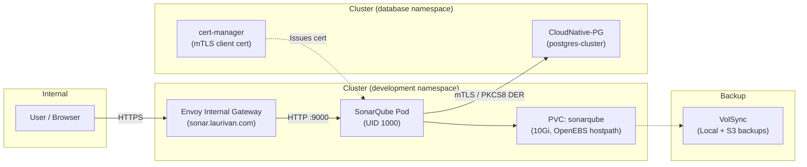

# SonarQube

SonarQube Community Build running at [https://sonar.laurivan.com](https://sonar.laurivan.com) (and [https://sonarqube.laurivan.com](https://sonarqube.laurivan.com)).

## Architecture

## Overview

- **Namespace**: `development`
- **Chart**: `bjw-s/app-template` v5.0.1
- **Database**: CloudNative-PG PostgreSQL (`postgres-cluster`) in `database` namespace
  - Authenticates via mTLS client certificates (`cert clientcert=verify-full`)
  - Private key converted to PKCS#8 DER at pod startup for pgjdbc compatibility
- **Persistence**:
  - `sonarqube` PVC (10Gi, `openebs-hostpath`) mounted at `/opt/sonarqube/data` and `/opt/sonarqube/extensions`
  - Backed up via VolSync (local and S3 replication)
- **Ingress**:
  - Gateway API `HTTPRoute` via `envoy-internal`
  - Hostnames: `sonar.laurivan.com`, `sonarqube.laurivan.com`
  - Homepage dashboard integration
