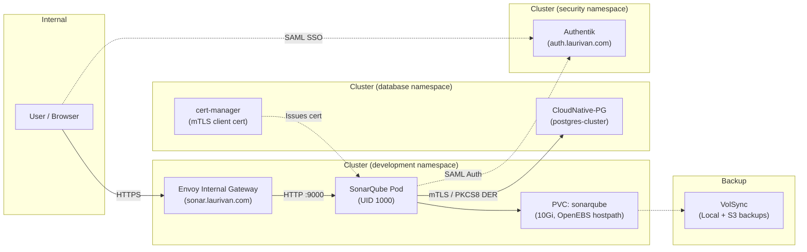

# SonarQube

SonarQube Community Build running at [https://sonar.laurivan.com](https://sonar.laurivan.com) (and [https://sonarqube.laurivan.com](https://sonarqube.laurivan.com)).

## Architecture


```mermaid
graph LR
    subgraph Internal
        User["User / Browser"]
    end

    subgraph "Cluster (development namespace)"
        Gateway["Envoy Internal Gateway<br/>(sonar.laurivan.com)"]
        SonarQube["SonarQube Pod<br/>(UID 1000)"]
        PVC["PVC: sonarqube<br/>(10Gi, OpenEBS hostpath)"]
    end

    subgraph "Cluster (database namespace)"
        CNPG["CloudNative-PG<br/>(postgres-cluster)"]
        CertManager["cert-manager<br/>(mTLS client cert)"]
    end

    subgraph "Cluster (security namespace)"
        Authentik["Authentik<br/>(auth.laurivan.com)"]
    end

    subgraph Backup
        VolSync["VolSync<br/>(Local + S3 backups)"]
    end

    User -->|HTTPS| Gateway
    Gateway -->|HTTP :9000| SonarQube
    User -.->|SAML SSO| Authentik
    SonarQube -.->|SAML Auth| Authentik
    SonarQube -->|mTLS / PKCS8 DER| CNPG
    CertManager -.->|Issues cert| SonarQube
    SonarQube --> PVC
    PVC -.-> VolSync
```

## Overview

- **Namespace**: `development`
- **Chart**: `bjw-s/app-template` v5.0.1
- **Database**: CloudNative-PG PostgreSQL (`postgres-cluster`) in `database` namespace
  - Authenticates via mTLS client certificates (`cert clientcert=verify-full`)
  - Client certificate private key is converted from PEM to PKCS#8 DER format at pod initialization for PostgreSQL JDBC driver compatibility
- **Persistence**:
  - `sonarqube` PVC (10Gi, `openebs-hostpath`) mounted at `/opt/sonarqube/data`
  - Ephemeral extensions directory at `/opt/sonarqube/extensions`
  - Backed up via VolSync (local NFS repository + remote S3 replication)
- **Ingress**:
  - Gateway API `HTTPRoute` via `envoy-internal`
  - Hostnames: `sonar.laurivan.com`, `sonarqube.laurivan.com`
  - Homepage dashboard integration

## Authentication & Authentik SSO

SonarQube integrates with **Authentik** using **SAML 2.0**.

> [!NOTE]
> **Why SAML instead of reverse proxy forward-auth?**
> SonarQube Community Edition natively supports SAML 2.0 without extra plugins. Placing forward-auth (e.g. Envoy `ext-auth`) directly on the ingress route will break CI/CD pipelines (SonarScanner in GitHub Actions / Forgejo Runner) and SonarLint IDE tokens because API calls to `/api/*` get redirected to the interactive login page. Native SAML provides a clean web SSO login button while allowing automated scanners to authenticate with their tokens unhindered.

### 1. Authentik Configuration (`auth.laurivan.com`)

1. Go to **Applications** &rarr; **Providers** &rarr; **Create**:
   - **Type**: `SAML Provider`
   - **Name**: `SonarQube`
   - **ACS URL**: `https://sonar.laurivan.com/oauth2/callback/saml`
   - **Audience / Entity ID**: `sonarqube`
   - **Service Provider Binding**: `Post`
   - **Signing Certificate**: Select your active certificate keypair
2. Go to **Applications** &rarr; **Applications** &rarr; **Create**:
   - **Name**: `SonarQube`
   - **Slug**: `sonarqube`
   - **Provider**: Select the `SonarQube` provider created above
3. From the Provider page:
   - Download the **Signing Certificate** (PEM).
   - Copy the **SSO URL** (e.g., `https://auth.laurivan.com/application/saml/sonarqube/sso/binding/redirect/`).
   - Copy the **Metadata URL** (e.g., `https://auth.laurivan.com/application/saml/sonarqube/metadata/`).

### 2. SonarQube Configuration (`sonar.laurivan.com`)

1. Log in as an administrator.
2. Ensure the base URL is set correctly in **Administration** &rarr; **Configuration** &rarr; **General Settings** &rarr; **General**:
   - **Server base URL**: `https://sonar.laurivan.com`
3. Navigate to **Administration** &rarr; **Configuration** &rarr; **General Settings** &rarr; **Authentication** &rarr; **SAML**:
   - **Enabled**: `true`
   - **Application ID**: `sonarqube` *(must match the Audience in Authentik)*
   - **Provider Name**: `Authentik` *(label on the login button)*
   - **Provider ID**: `https://auth.laurivan.com/application/saml/sonarqube/metadata/`
   - **SAML login URL**: `https://auth.laurivan.com/application/saml/sonarqube/sso/binding/redirect/`
   - **Identity provider certificate**: Paste the certificate text downloaded from Authentik
   - **SAML user login attribute**: `http://schemas.goauthentik.io/2021/02/saml/username` (or `http://schemas.xmlsoap.org/ws/2005/05/identity/claims/name`)
   - **SAML user name attribute**: `http://schemas.xmlsoap.org/ws/2005/05/identity/claims/name`
   - **SAML user email attribute**: `http://schemas.xmlsoap.org/ws/2005/05/identity/claims/emailaddress`
   - *(Optional)* **SAML group attribute**: `http://schemas.xmlsoap.org/claims/Group` (for group synchronization)
4. Click **Test Configuration** to verify authentication against Authentik before logging out.

## Credentials & Secrets

### Initial Web Credentials
- **Username**: `admin`
- **Password**: `admin`
- On first login, SonarQube prompts you to change the administrator password.

### Kubernetes Secrets

| Secret Name | Managed By | Description |
| ----------- | ---------- | ----------- |
| `postgres-sonarqube-cert` | `cert-manager` | Client mTLS certificate issued by `postgres-cluster-client-ca-issuer`. Mounted at `/var/run/secrets/postgresql/` and converted to `/opt/sonarqube/certs/tls.pk8` by the `init` container. |
| `sonarqube-postgres` | Flux component (`components/cnpg/app`) | Contains connection parameters generated by the CNPG app component. |
| `sonarqube-volsync-secret` | `external-secrets` | Extracted from Bitwarden (`volsync_template`) for local Kopia backups. |
| `sonarqube-volsync-s3-secret` | `external-secrets` | Extracted from Bitwarden (`volsync_s3_template`) for remote S3 backups. |

> [!NOTE]
> No manual secrets or passwords are required for the database connection; authentication is fully automated via mTLS client certificates.

### Administration & Troubleshooting

- **Admin Password Reset**:
  If the `admin` password is lost, you can generate a hash and update PostgreSQL directly:
  ```bash
  # Generate bcrypt hash (e.g. for a new password)
  # Update the users table in the database:
  kubectl exec -n database postgres-cluster-1 -c postgres -- psql -U postgres -d sonarqube \
    -c "UPDATE users SET crypted_password = '<hash>', salt = null, hash_method = 'BCRYPT' WHERE login = 'admin';"
  ```
