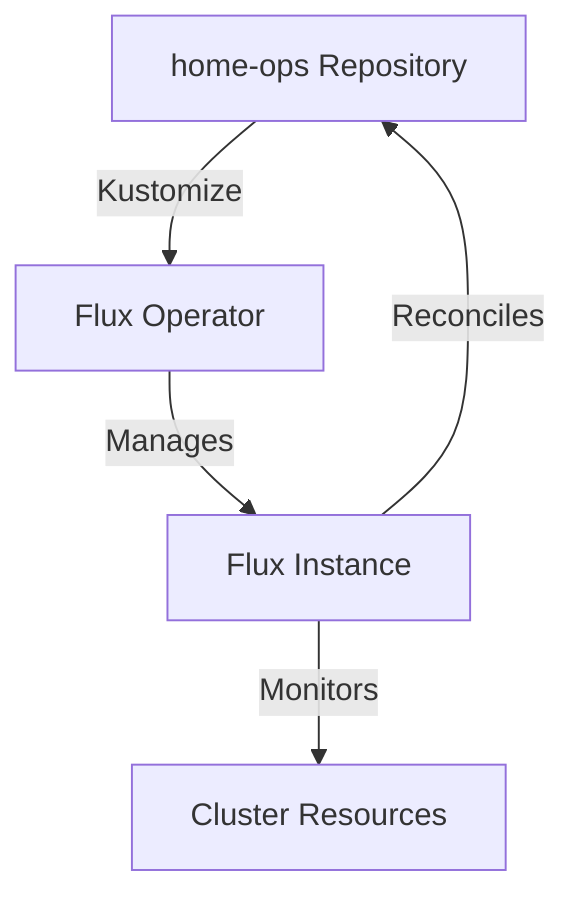

# Flux System

This directory manages the core **Flux GitOps** infrastructure for the cluster. It bootstraps the Flux Operator and configures the primary Flux Instance that reconciles the entire `home-ops` repository.

## 🏗️ Architecture

The system follows a tiered bootstrapping approach:



1.  **Flux Operator**: Installed via Helm, it manages the lifecycle of Flux instances.
2.  **Flux Instance**: The primary GitOps engine that watches the `home-ops` repository and applies changes to the cluster.
3.  **Health Checks**: Specialized Kustomizations that ensure CRDs and core system components (like Rook-Ceph) are ready before other applications are deployed.

## 🧩 Components

| Component | Description | Path |
| :--- | :--- | :--- |
| **Flux Operator** | The controller that manages Flux instances. | [`./flux-operator`](./flux-operator) |
| **Flux Instance** | The main Flux controllers (source, kustomize, helm, notification). | [`./flux-instance`](./flux-instance) |
| **Healthchecks** | Dependency gates for CRDs and core storage systems. | [`./healthcheck`](./healthcheck) |

## 🔑 Prerequisites

The following secrets must be present in the `flux-system` namespace for the system to function correctly:

### 1. SOPS Age Key
Flux uses SOPS with Age for decrypting secrets.
- **Secret Name**: `sops-age`
- **Requirement**: Must contain the `age.agekey` used for encryption in this repository.
- **Reference**: Enabled in `flux-instance` via the `--sops-age-secret=sops-age` flag.

### 2. GitHub Webhook Token
Used for receiving push events from GitHub to trigger immediate reconciliations.
- **Secret Name**: `github-webhook-token-secret`
- **File**: Managed in [`secret.sops.yaml`](./flux-instance/app/secret.sops.yaml)

## ⚙️ Configuration Highlights

- **Performance Tuning**: Controllers are configured with increased concurrency (`--concurrent=10`) and memory limits (`1Gi`).
- **In-Memory Kustomize**: The `kustomize-controller` uses an `emptyDir` (Memory) for builds to improve performance and reduce disk I/O.
- **Feature Gates**:
    - `OOMWatch=true`: Enhanced memory monitoring for the Helm controller.
    - `CancelHealthCheckOnNewRevision=true`: Optimizes reconciliation by canceling stale health checks.
- **SOPS Integration**: Native controller-level decryption is enabled for `kustomize-controller`.

## 🛠️ Maintenance

### Updating Flux
To update the Flux version, modify the `artifact` URL in [`flux-instance/app/helmrelease.yaml`](./flux-instance/app/helmrelease.yaml):

```yaml
instance:
  distribution:
    artifact: oci://ghcr.io/controlplaneio-fluxcd/flux-operator-manifests:vX.Y.Z
```

### Manual Reconciliation
If you need to force a sync of the main cluster state:
```bash
flux reconcile ks flux-system --with-source
```
