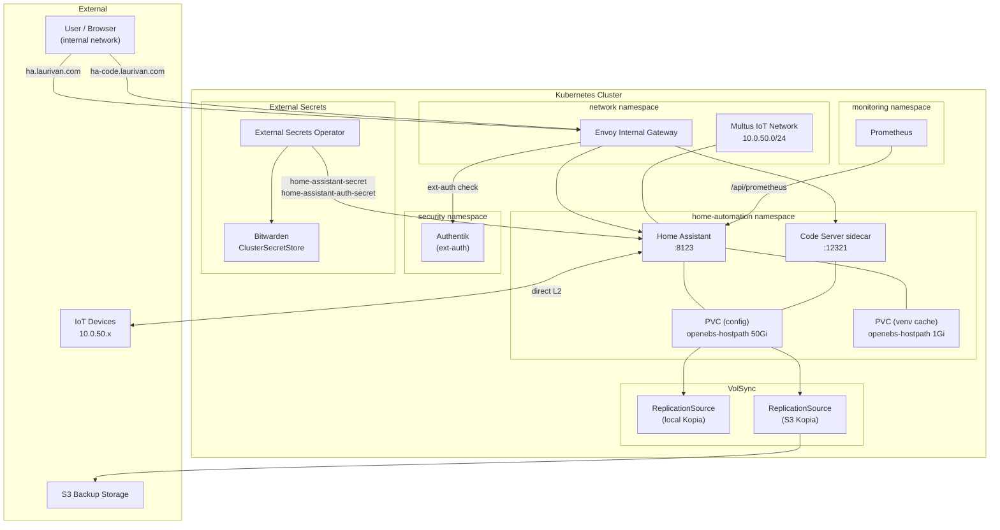

# Home Assistant

Home Assistant is the central home automation platform, deployed via the
[app-template](https://github.com/bjw-s-labs/helm-charts/tree/main/charts/other/app-template)
Helm chart and managed by Flux.

## What it does

- Runs the [Home Assistant](https://www.home-assistant.io/) core application
  (`ghcr.io/home-operations/home-assistant`) for smart-home control and
  automation.
- Attaches to a dedicated **IoT network** (`10.0.50.0/24`) via Multus so it can
  communicate directly with IoT devices without hairpinning through the main
  cluster network.
- Includes a **code-server** sidecar for in-browser editing of HA configuration
  files.
- Both routes are **internal-only** — the HA UI at `ha.laurivan.com` and the
  code-server UI at `ha-code.laurivan.com` are served through the internal Envoy
  Gateway. The code-server route is additionally protected by Authentik external
  auth.
- Publishes Prometheus metrics at `/api/prometheus` (scraped by the
  ServiceMonitor).
- Persistent data is backed up with **VolSync** (local Kopia every 2 h, remote
  S3 daily).

## Multus Network (`k8s.v1.cni.cncf.io/networks`)

The pod annotation `k8s.v1.cni.cncf.io/networks` instructs **Multus CNI** to
attach an additional network interface to the pod beyond the default cluster
network. The annotation value is a JSON array of network attachment requests:

```json
[{
  "name": "iot",
  "namespace": "network",
  "ips": ["10.0.50.70/24"],
  "mac": "3e:59:e4:f7:43:08"
}]
```

| Field | Value | Purpose |
|-------|-------|---------|
| `name` | `iot` | References a `NetworkAttachmentDefinition` CR in the cluster |
| `namespace` | `network` | Namespace where the NAD is defined |
| `ips` | `10.0.50.70/24` | Static IP assigned to the secondary interface |
| `mac` | `3e:59:e4:f7:43:08` | Fixed MAC address for stable DHCP/firewall rules |

This gives Home Assistant a dedicated Layer 2 presence on the IoT subnet,
enabling protocols that rely on broadcast/multicast discovery (mDNS, SSDP,
HomeKit) which don't work through a routed cluster network.

## Authentik Configuration

The code-server route (`ha-code.laurivan.com`) is protected by Authentik
external authentication via an Envoy Gateway `SecurityPolicy`. The HA UI route
(`ha.laurivan.com`) is **not** gated by ext-auth — it uses HA's own login.

To set this up in Authentik:

### 1. Create a Proxy Provider

1. In the Authentik admin UI, go to **Applications → Providers → Create**.
2. Choose **Proxy Provider**.
3. Configure:
   - **Name**: `home-assistant-code` (or similar)
   - **Authorization flow**: select your default authorization flow
   - **Mode**: Forward auth (single application)
   - **External host**: `https://ha-code.laurivan.com`
4. Save.

### 2. Create an Application

1. Go to **Applications → Applications → Create**.
2. Configure:
   - **Name**: `Home Assistant Code Server`
   - **Slug**: `home-assistant-code`
   - **Provider**: select the proxy provider created above
   - **Launch URL**: `https://ha-code.laurivan.com`
3. Save.

### 3. Assign to the Embedded Outpost

1. Go to **Applications → Outposts**.
2. Edit the **authentik Embedded Outpost**.
3. Under **Applications**, add the `Home Assistant Code Server` application.
4. Save. The outpost will reconcile and begin handling auth requests.

### 4. Verify the ReferenceGrant

The `ReferenceGrant` in the `security` namespace already allows SecurityPolicy
resources in the `home-automation` namespace to reference the outpost Service.
No additional grant is needed.

### How it works

The ext-auth component creates a `SecurityPolicy` targeting the HTTPRoute named
`home-assistant-code` (set via `EXT_AUTH_TARGET` in `app.ks.yaml`). When a
request hits that route, Envoy forwards the auth check to the Authentik embedded
outpost at:

```
http://ak-outpost-authentik-embedded-outpost.security:9000/outpost.goauthentik.io/auth/envoy
```

If the user has a valid session cookie, the request proceeds. Otherwise, they
are redirected to the Authentik login page.

## Secrets

Secrets are pulled from **Bitwarden** via the External Secrets Operator using a
`ClusterSecretStore` named `bitwarden`.

| Secret | Key(s) | Purpose |
|--------|--------|---------|
| `home-assistant-secret` | `HASS_ELEVATION`, `HASS_LATITUDE`, `HASS_LONGITUDE`, `HASS_GOOGLE_PROJECT_ID`, `HASS_GOOGLE_SECURE_DEVICES_PIN` | Location and Google integration credentials injected as env vars |
| `home-assistant-auth-secret` | `HASS_LONG_LIVED_TOKEN` | Long-lived access token used by the Prometheus ServiceMonitor to scrape metrics |

Both ExternalSecrets extract from the Bitwarden item `home_assistant`.

## Architecture



### Component Summary

| Component | Role |
|-----------|------|
| **Home Assistant** | Core home-automation engine — runs automations, integrations, and the web UI on port 8123 |
| **Code Server** | VS Code in the browser (sidecar container on port 12321) for editing HA YAML configs |
| **Envoy Internal Gateway** | Routes internal traffic to both `ha.laurivan.com` and `ha-code.laurivan.com`; code-server route is gated by Authentik |
| **Authentik (ext-auth)** | Provides SSO / external authentication for the code-server route |
| **Multus IoT Network** | Secondary CNI interface on `10.0.50.0/24` giving HA direct Layer 2 access to IoT devices via the `k8s.v1.cni.cncf.io/networks` annotation |
| **IoT Devices** | Smart-home hardware (sensors, switches, lights, etc.) on the isolated IoT subnet |
| **Prometheus** | Scrapes HA metrics via `/api/prometheus` using a long-lived token |
| **VolSync (local)** | Kopia-based ReplicationSource backing up the config PVC to local storage every 2 hours |
| **VolSync (remote)** | Kopia-based ReplicationSource backing up the config PVC to S3 daily |
| **S3 Backup Storage** | Off-cluster object storage holding remote Kopia snapshots |
| **External Secrets Operator** | Syncs secrets from Bitwarden into Kubernetes Secrets consumed by HA |
| **Bitwarden** | Source of truth for credentials (location data, Google project config, Prometheus token) |
| **PVC (config)** | 50 Gi `openebs-hostpath` volume holding all HA configuration and state |
| **PVC (venv cache)** | 1 Gi `openebs-hostpath` volume caching the HA Python virtual environment |
