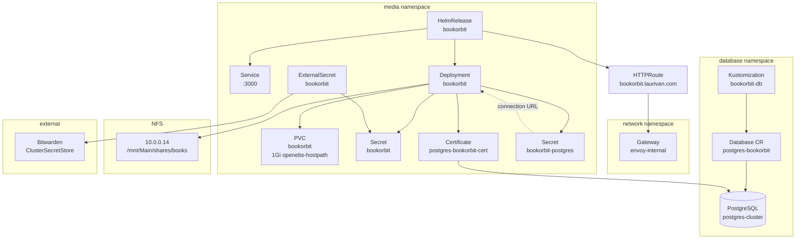

# BookOrbit

[BookOrbit](https://bookorbit.app/) is a self-hosted digital library and book manager for EPUB, PDF, comics, and audiobooks. It features smart shelves, metadata management, Kobo/KOReader sync, OPDS support, and a built-in reader.

- **Upstream docs**: https://bookorbit.app/installation.html
- **Source**: https://github.com/bookorbit/bookorbit

## Architecture

## Secrets

### Bitwarden item: `bookorbit`

Create a Bitwarden item named `bookorbit` with the following fields:

| Field | Description | Generation |
|-------|-------------|------------|
| `JWT_SECRET` | Secret for signing login tokens | `openssl rand -hex 32` |
| `SETUP_BOOTSTRAP_TOKEN` | One-time token for initial admin setup | `openssl rand -hex 16` |

### Auto-generated secrets

| Secret | Source | Purpose |
|--------|--------|---------|
| `bookorbit-postgres` | CNPG component | PostgreSQL connection URL with mTLS params |
| `postgres-bookorbit-cert` | cert-manager | TLS client certificate for PostgreSQL auth |

## Kubernetes Parameters

### Endpoints

| Parameter | Value |
|-----------|-------|
| Internal URL | `https://bookorbit.laurivan.com` |
| Gateway | `envoy-internal` (namespace: `network`) |
| Service port | `3000` |

### Resources

| Resource | Request | Limit |
|----------|---------|-------|
| CPU | 50m | — |
| Memory | 256Mi | 2Gi |

### Storage

| Volume | Type | Path | Size |
|--------|------|------|------|
| `data` | PVC (openebs-hostpath) | `/data` | 1Gi |
| `books` | NFS (`10.0.0.14`) | `/books` | `/mnt/Main/shares/books` |
| `postgres-certs` | Secret | `/var/run/secrets/postgresql` | — |

### Database

| Parameter | Value |
|-----------|-------|
| Cluster | `postgres-cluster` (namespace: `database`) |
| Database name | `bookorbit` |
| Owner | `bookorbit` |
| Extensions | `uuid-ossp`, `pg_trgm`, `vector` (pgvector) |
| Auth | mTLS via cert-manager |

### Environment Variables

| Variable | Value | Source |
|----------|-------|--------|
| `APP_URL` | `https://bookorbit.laurivan.com` | helmrelease |
| `APP_PORT` | `3000` | helmrelease |
| `DATABASE_URL` | `postgresql://bookorbit@...` | `bookorbit-postgres` secret |
| `JWT_SECRET` | — | `bookorbit` secret (Bitwarden) |
| `SETUP_BOOTSTRAP_TOKEN` | — | `bookorbit` secret (Bitwarden) |
| `PUID` / `PGID` | `1000` | helmrelease |

## Enabling

1. Create the Bitwarden item `bookorbit` with the fields above
2. Uncomment `#- ./bookorbit` in [`kubernetes/apps/media/kustomization.yaml`](../kustomization.yaml)
3. Commit and push — Flux will create the database, certificate, and deploy the app

## References

- [`app.ks.yaml`](./app.ks.yaml) — Flux Kustomization with CNPG and VolSync components
- [`app/helmrelease.yaml`](./app/helmrelease.yaml) — App deployment via app-template chart
- [`app/externalsecret.yaml`](./app/externalsecret.yaml) — Bitwarden secret sync
- [`../../components/cnpg/app`](../../components/cnpg/app) — CNPG database component
- [`../../components/volsync`](../../components/volsync) — VolSync backup component
