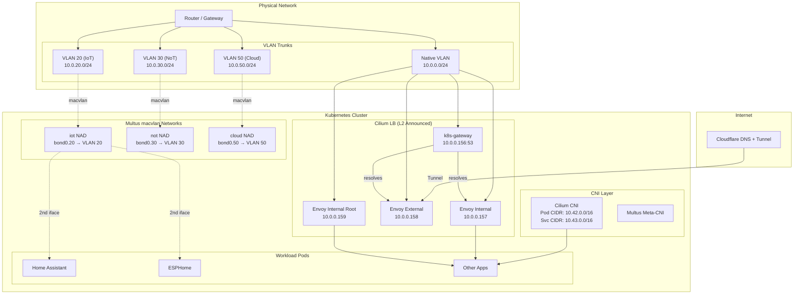

# Network Stack

This directory contains the networking infrastructure for the Kubernetes cluster.

## Components

| App | Purpose |
|-----|---------|
| **Cilium** | Primary CNI (in `kube-system`). Provides pod networking, kube-proxy replacement, L2 announcements, and LoadBalancer IP allocation. |
| **Multus** | Meta-CNI plugin. Attaches additional macvlan interfaces to pods for direct VLAN access. |
| **Envoy Gateway** | Gateway API implementation. Handles HTTP/HTTPS ingress for internal and external traffic. |
| **k8s-gateway** | CoreDNS-based DNS server. Resolves cluster Gateway/Service hostnames for the local network. |
| **Cloudflare DNS** | External DNS provider. Syncs DNS records to Cloudflare. |
| **Cloudflare Tunnel** | Secure tunnel for external access without exposing ports. |
| **Certificates** | TLS certificate management (cert-manager issuers/certs). |

## Subnet Layout

| Subnet | VLAN | Purpose | Gateway |
|--------|------|---------|---------|
| `10.0.0.0/24` | Native | Management / Control plane nodes + Cilium LB pool | `10.0.0.1` |
| `10.0.20.0/24` | 20 | IoT devices | `10.0.20.1` |
| `10.0.30.0/24` | 30 | NoT (Network of Things) | `10.0.30.1` |
| `10.0.50.0/24` | 50 | Cloud / Worker nodes (blades) | `10.0.50.1` |
| `10.42.0.0/16` | — | Pod CIDR (Cilium) | — |
| `10.43.0.0/16` | — | Service CIDR | — |

## Cilium LoadBalancer IPs

Allocated from the `10.0.0.0/24` pool via `CiliumLoadBalancerIPPool`, announced with L2 (ARP) from control plane nodes.

| IP | Service |
|----|---------|
| `10.0.0.155` | Talos API VIP (not Cilium-managed) |
| `10.0.0.156` | k8s-gateway (DNS) |
| `10.0.0.157` | Envoy Internal Gateway (`*.laurivan.com`) |
| `10.0.0.158` | Envoy External Gateway (`*.laurivan.com`) |
| `10.0.0.159` | Envoy Internal Root Gateway (`laurivan.com`) |

## Multus Networks (NetworkAttachmentDefinitions)

Multus provides secondary interfaces to pods via macvlan on VLAN-tagged bonds. Each uses static IPAM (IPs assigned per-pod in annotations) and source-based routing (`sbr`) to prevent return traffic leaking into the primary CNI interface.

| NAD Name | Master Interface | VLAN | Subnet | Gateway |
|----------|-----------------|------|--------|---------|
| `iot` | `bond0.20` | 20 | `10.0.20.0/24` | `10.0.30.1` |
| `not` | `bond0.30` | 30 | `10.0.30.0/24` | `10.0.30.1` |
| `cloud` | `bond0.50` | 50 | `10.0.50.0/24` | `10.0.50.1` |

## Ingress Flow

- **Internal**: Client → DNS (`k8s-gateway` @ `10.0.0.156`) → Envoy Internal (`10.0.0.157`) → HTTPRoute → Pod
- **External**: Client → Cloudflare → Tunnel → Envoy External (`10.0.0.158`) → HTTPRoute → Pod

## Architecture Diagram



## ESXi VLAN Trunk Setup

Multus macvlan interfaces require the host to have access to the underlying VLANs. The ESXi VMs currently only have a single vNIC on the native/management network. To enable Multus on ESXi nodes, a second vNIC carrying VLAN-tagged traffic must be added.

### Which nodes need the trunk?

Add the VLAN trunk vNIC to **worker nodes only** (currently `esxi-2cu-8g-04`). Control plane nodes should remain lean — they run Cilium L2 announcements and the API server but don't need to schedule Multus-attached workloads. The blade/CM5 workers already have physical access to VLANs via their bond interface.

If you later want Multus pods on control plane nodes too, repeat the same steps for those.

### Step-by-step (UniFi + ESXi)

#### 1. UniFi: Configure the switch port as a trunk

1. Open UniFi Network → **Settings → Ports**
2. Find the port(s) connected to your ESXi host
3. Set the port profile to **All** (trunks all VLANs), or create a custom profile:
   - Native VLAN: your management VLAN (untagged)
   - Tagged VLANs: 20, 30, 50

#### 2. ESXi: Create a VLAN trunk port group

1. In the ESXi host client, go to **Networking → Virtual switches**
2. On your existing vSwitch (or a new one if you prefer isolation), click **Add port group**:
   - Name: `VLAN-Trunk`
   - VLAN ID: **4095** (passes all VLAN tags through to the VM)
3. Edit the port group security settings:
   - **Promiscuous Mode**: Accept
   - **Forged Transmits**: Accept
   - **MAC Address Changes**: Accept
4. (These are required because macvlan generates traffic with MAC addresses different from the vNIC's)

#### 3. ESXi: Add a second vNIC to the Talos VM

1. Edit the VM settings → **Add network adapter**
2. Attach it to the `VLAN-Trunk` port group
3. Note the MAC address assigned (visible in VM settings after adding)

#### 4. Talos: Configure the new interface with a bond + VLANs

In `talconfig.yaml`, add the second interface to the node's `networkInterfaces`. Using a bond gives a stable, predictable name (`bond0`) that the Multus NADs already reference:

```yaml
- hostname: "esxi-2cu-8g-04"
  networkInterfaces:
    # Existing management interface
    - deviceSelector:
        hardwareAddr: "34:97:87:58:7b:10"
      dhcp: false
      addresses:
        - "10.0.0.123/24"
      routes:
        - gateway: "10.0.0.1"
          network: 0.0.0.0/0
      mtu: 1500
    # VLAN trunk interface (new vNIC)
    - deviceSelector:
        hardwareAddr: "xx:xx:xx:xx:xx:xx"  # MAC of the new vNIC
      bond:
        deviceSelectors:
          - hardwareAddr: "xx:xx:xx:xx:xx:xx"
        mode: active-backup
      vlans:
        - vlanId: 20
        - vlanId: 30
        - vlanId: 50
```

#### 5. Apply and verify

```bash
# Generate new config
task talos:generate-config

# Apply to the node
talosctl apply-config --nodes 10.0.0.123 --file talos/clusterconfig/kubernetes-esxi-2cu-8g-04.yaml

# Verify VLAN interfaces are up
TALOSCONFIG=/home/laur/dev/talos/home-ops/talos/clusterconfig/talosconfig \
  talosctl get links --nodes 10.0.0.123 | grep bond0
```

You should see `bond0`, `bond0.20`, `bond0.30`, and `bond0.50` all in `up` state.

## Notes

- Cilium is configured with `cni.exclusive: false` to allow Multus to operate alongside it.
- L2 announcements are restricted to control plane nodes via `nodeSelector`.
- Multus pods require `bond0.<vlan>` to exist on the host — schedule workloads using Multus NADs only on nodes with the appropriate VLAN interfaces.
- Source-based routing (`sbr` plugin) ensures return traffic from Multus interfaces exits via the correct gateway rather than the default route.
- ESXi VMs need a dedicated VLAN trunk vNIC with permissive security settings for macvlan to work.
