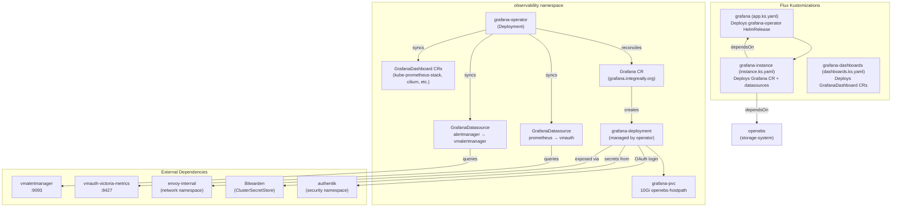
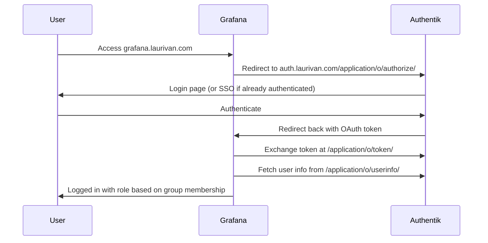

# Grafana

Grafana is deployed using the [grafana-operator](https://github.com/grafana/grafana-operator) pattern, where the operator manages the Grafana instance, datasources, and dashboards declaratively via Custom Resources.

## Architecture



## Directory Structure

```
grafana/
├── app/                    # grafana-operator HelmRelease
│   ├── helmrelease.yaml    # Operator deployment
│   ├── ocirepository.yaml  # Chart source
│   └── grafanadashboard.yaml  # Operator-specific dashboards
├── instance/               # Grafana instance configuration
│   ├── grafana.yaml        # Grafana CR (the actual Grafana server)
│   ├── externalsecret.yaml # OAuth + admin credentials from Bitwarden
│   ├── grafanadatasource.yaml  # Prometheus + Alertmanager datasources
│   └── servicemonitor.yaml # Metrics scraping
├── dashboards/             # GrafanaDashboard CRs
│   ├── kube-prometheus-stack.yaml
│   ├── cilium.yaml
│   └── ...
├── app.ks.yaml             # Flux Kustomization for operator
├── instance.ks.yaml        # Flux Kustomization for instance (depends on app + openebs)
├── dashboards.ks.yaml      # Flux Kustomization for dashboards
└── kustomization.yaml      # Top-level kustomize resources
```

## Authentication via Authentik

Grafana uses Authentik as its OAuth/OIDC provider. Users do not log in with local credentials — authentication is handled entirely by Authentik.

### How It Works



### Configuration

The OAuth configuration is defined in the `Grafana` CR (`instance/grafana.yaml`):

| Setting | Value |
|---------|-------|
| Provider | `generic_oauth` (OpenID Connect) |
| Auto-login | Enabled (`oauth_auto_login: true`) |
| Scopes | `openid email profile groups` |
| Auth URL | `https://auth.laurivan.com/application/o/authorize/` |
| Token URL | `https://auth.laurivan.com/application/o/token/` |
| UserInfo URL | `https://auth.laurivan.com/application/o/userinfo/` |
| Signout redirect | `https://auth.laurivan.com/application/o/grafana/end-session/` |

### Role Mapping

Grafana roles are assigned based on Authentik group membership:

| Authentik Group | Grafana Role |
|-----------------|--------------|
| `Grafana Admins` | Admin |
| `Grafana Editors` | Editor |
| *(any other)* | Viewer |

This is configured via `role_attribute_path`:
```
contains(groups[*], 'Grafana Admins') && 'Admin' || contains(groups[*], 'Grafana Editors') && 'Editor' || 'Viewer'
```

### Anonymous Access

Anonymous access is enabled for read-only viewing (Viewer role, Main Org). This allows dashboards to be viewed without authentication.

### Secrets

OAuth credentials are stored in Bitwarden and injected via ExternalSecret:

- `GF_AUTH_GENERIC_OAUTH_CLIENT_ID` — Authentik application client ID
- `GF_AUTH_GENERIC_OAUTH_CLIENT_SECRET` — Authentik application client secret
- `GF_SECURITY_ADMIN_PASSWORD` — Local admin fallback password

## Dependencies

| Dependency | Namespace | Purpose |
|------------|-----------|---------|
| **grafana-operator** | observability | Manages the Grafana instance lifecycle |
| **openebs** | storage-system | Provides `openebs-hostpath` StorageClass for Grafana PVC |
| **authentik** | security | OAuth/OIDC authentication provider |
| **victoria-metrics** | observability | Metrics datasource (via vmauth proxy) |
| **vmalertmanager** | observability | Alertmanager datasource |
| **external-secrets** | security | Syncs OAuth credentials from Bitwarden |
| **envoy-internal** | network | Gateway for `grafana.laurivan.com` HTTPRoute |
| **cert-manager** | cert-manager | TLS certificates for the HTTPRoute |

## Datasources

Datasources are managed declaratively via `GrafanaDatasource` CRs:

- **prometheus** (default) — Points to `vmauth-victoria-metrics:8427` which proxies to VMSingle
- **alertmanager** — Points to `vmalertmanager-victoria-metrics:9093`

## Dashboards

Dashboards are managed via `GrafanaDashboard` CRs that reference upstream Grafana.com dashboard IDs or inline JSON. They are automatically synced by the grafana-operator. Individual apps can also ship their own `GrafanaDashboard` CRs (e.g., authentik, CNPG, cilium).

All dashboards use `instanceSelector.matchLabels: grafana.internal/instance: grafana` to target this Grafana instance.

## Accessing Grafana

- **URL**: https://grafana.laurivan.com
- **Login**: Automatic via Authentik SSO (or anonymous Viewer access)
- **Admin**: Members of the `Grafana Admins` group in Authentik
