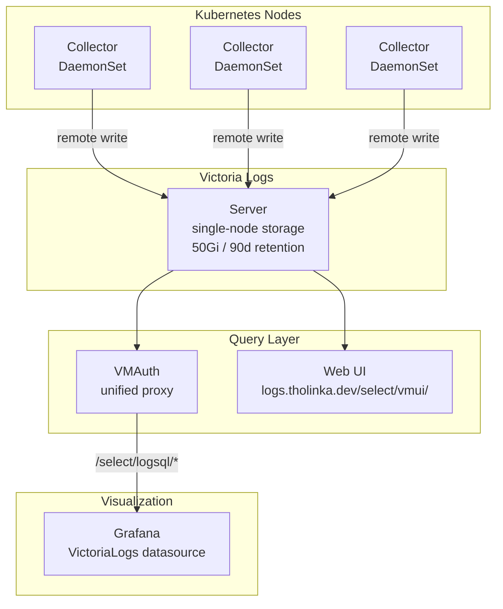

# Victoria Logs

## Overview

Victoria Logs is the centralized log aggregation system for this cluster. It provides a lightweight, high-performance log storage and querying solution compatible with LogsQL. It is deployed as two components: a single-node server for storage/query and a collector DaemonSet that ships logs from all nodes.

## Architecture



### Components

| Component | Chart | Version | Purpose |
|-----------|-------|---------|---------|
| **Server** | `victoria-logs-single` | 0.12.4 | Single-node log storage and query engine |
| **Collector** | `victoria-logs-collector` | 0.3.3 | DaemonSet that tails container logs and ships to server |

## Configuration

### Server

- **Chart:** `victoria-logs-single` v0.12.4
- **Source:** `oci://ghcr.io/victoriametrics/helm-charts/victoria-logs-single`
- **Image registry:** `quay.io`
- **Storage:** 50Gi on `ceph-block`
- **Retention:** 90 days
- **Web UI:** `logs.tholinka.dev` (redirects `/` to `/select/vmui/`)
- **ServiceMonitor:** enabled

### Collector

- **Chart:** `victoria-logs-collector` v0.3.3
- **Source:** `oci://ghcr.io/victoriametrics/helm-charts/victoria-logs-collector`
- **Image registry:** `quay.io`
- **Remote write target:** `http://victoria-logs-server.observability.svc.cluster.local:9428`
- **Resources:**
  - Requests: 10m CPU, 64Mi memory
  - Limits: 100m CPU, 128Mi memory
- **PodMonitor:** enabled (scraped by Victoria Metrics)

### Querying

Logs can be queried via:
1. **Direct UI** at `logs.tholinka.dev/select/vmui/`
2. **VMAuth proxy** at `vmauth-victoria-metrics:8427/select/logsql/...` (used by Grafana)
3. **LogsQL API** at `victoria-logs-server:9428/select/logsql/query`

### Grafana Integration

Dashboards are provisioned via the Grafana Operator (`dashboards.grafanaOperator.enabled: true`). The VictoriaLogs datasource is accessed through VMAuth, which routes `/select/logsql/*` requests to the logs server.

### Ext-Auth (Authentik)

The logs web UI at `logs.tholinka.dev` is protected by a SecurityPolicy via authentik's embedded outpost (ext-auth component).

## Secrets

Victoria Logs does not require any secrets. It operates without authentication for internal cluster communication. External access is protected by the Envoy Gateway ext-auth SecurityPolicy (authentik).

## Dependencies

- `storage-ready` (flux-system) — ensures Ceph storage is available for the server PVC
- Victoria Metrics VMAuth — provides the unified query proxy for Grafana
- Grafana Operator — for dashboard provisioning

## LogsQL Quick Reference

Common queries for the Victoria Logs UI:

```
# All logs from a namespace
_namespace:"home-automation"

# Logs from a specific pod
_pod:"home-assistant-*"

# Error-level logs
_level:"error"

# Full-text search
"connection refused"

# Combined filters
_namespace:"observability" AND _level:"error" AND "timeout"

# Time-bounded (last 1 hour)
_time:1h
```
