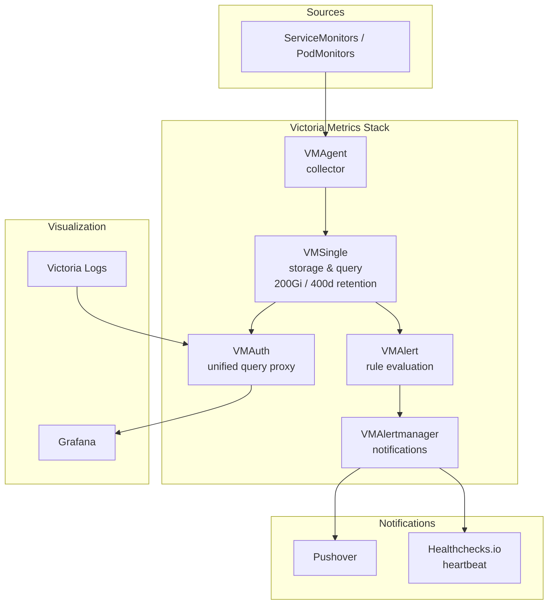

# Victoria Metrics

## Overview

Victoria Metrics is the primary metrics storage and monitoring stack for this cluster. It is deployed via the [victoria-metrics-k8s-stack](https://github.com/VictoriaMetrics/helm-charts/tree/master/charts/victoria-metrics-k8s-stack) Helm chart (v0.78.0), which bundles multiple components into a single deployment.

Victoria Metrics provides a Prometheus-compatible time-series database with better performance and lower resource usage than Prometheus itself.

## Architecture



### Components

| Component | Purpose | Endpoint |
|-----------|---------|----------|
| **VMSingle** | Single-node time-series database | `metrics.tholinka.dev` |
| **VMAgent** | Scrapes metrics from targets and remote-writes to VMSingle | Internal |
| **VMAlert** | Evaluates alerting/recording rules | `alerts.tholinka.dev` |
| **VMAlertmanager** | Routes and sends alert notifications | `alertmanager.tholinka.dev` |
| **VMAuth** | Authentication proxy and unified query router | Internal (port 8427) |
| **VM Operator** | Manages VM CRDs and reconciles resources | Internal |

### VMAuth Routing

VMAuth acts as a unified query endpoint that routes requests:
- `/api/v1/query.*` and `/api/v1/label/.*` → VMSingle (metrics)
- `/select/logsql/.*` → Victoria Logs (logs)

This allows Grafana to use a single datasource for both metrics and logs.

## Configuration

### Helm Chart

- **Chart:** `victoria-metrics-k8s-stack` v0.78.0
- **Source:** `oci://ghcr.io/victoriametrics/helm-charts/victoria-metrics-k8s-stack`
- **Image registry:** `quay.io`

### Storage

- **VMSingle:** 200Gi on `ceph-block`, retention 400 days
- **VMAlertmanager:** emptyDir (ephemeral, no persistent storage)

> **Note:** VMAlertmanager uses emptyDir instead of a PVC due to openebs-hostpath subPath permission issues. Alertmanager state (silences, notification log) is lost on pod restart. This is acceptable because:
> - Silences can be recreated manually
> - The notification log only prevents duplicate notifications within `repeat_interval`
> - Alert rules and routing config are stored in the HelmRelease (gitops)

#### Restoring VMAlertmanager State After Restart

Alertmanager state consists of two things:

1. **Silences** — If you had active silences before a restart, recreate them:
   ```bash
   # List what was silenced (check git history or Alertmanager UI before restart)
   # Create a new silence via the UI at https://alertmanager.laurivan.com/#/silences/new
   # Or via amtool:
   kubectl exec -n observability vmalertmanager-victoria-metrics-0 -c alertmanager -- \
     amtool silence add --alertmanager.url=http://localhost:9093 \
     alertname="MyAlert" --comment="Reason" --duration="2h"
   ```

2. **Notification log** — This tracks which notifications were already sent to avoid duplicates. After a restart, you may receive duplicate notifications for currently-firing alerts (one extra round). No action needed — it self-heals after one `repeat_interval` cycle (12h).

### Scrape Targets

In addition to in-cluster ServiceMonitors/PodMonitors, external targets are scraped via ScrapeConfig:

| Target | Endpoint | Metrics Path |
|--------|----------|--------------|
| NAS node-exporter | `nas.servers.internal:9100` | `/metrics` |
| NAS smartctl | `nas.servers.internal:9633` | `/metrics` |

### Alerting

Alerts are routed via VMAlertmanager:
- **Pushover** — primary notification channel for all firing alerts
- **Heartbeat** — Watchdog alert sent to healthchecks.io every 5 minutes
- **Blackhole** — suppresses `InfoInhibitor` alerts

Inhibition rules suppress warning-level alerts when a critical alert with the same name and namespace is firing.

### Custom Alert Rules

| Rule Group | Alert | Description |
|------------|-------|-------------|
| dockerhub | DockerhubRateLimitRisk | >100 containers pulling from Docker Hub |
| oom | OomKilled | Container OOMKilled ≥1 time in 10 minutes |
| btrfs | BtrfsDeviceErrorsDetected | BTRFS device errors detected |
| btrfs | BtrfsDeviceAlmostFull | BTRFS device <1% free space |

### Grafana Dashboards

Dashboards are provisioned via GrafanaDashboard CRDs using the Grafana Operator:
- Kubernetes API Server, CoreDNS, Global, Namespaces, Nodes, Pods, Volumes, PVC
- etcd Storage
- Node Exporter Full

### Ext-Auth (Authentik)

Three SecurityPolicies protect the web UIs via authentik:
- `vmsingle-victoria-metrics` (metrics UI)
- `vmalert-victoria-metrics` (alerts UI)
- `vmalertmanager-victoria-metrics` (alertmanager UI)

## Secrets

Secrets are managed via ExternalSecrets pulling from the `bitwarden` ClusterSecretStore.

### `vmalertmanager` Secret

Created from Bitwarden items `pushover` and `alertmanager`.

| Key | Description | Default/Example |
|-----|-------------|-----------------|
| `ALERTMANAGER_PUSHOVER_TOKEN` | Pushover application API token for alertmanager notifications | `axxxxxxxxxxxxxxxxxxxxxxxxxxxxx` (30-char alphanumeric) |
| `PUSHOVER_USER_KEY` | Pushover user/group key to receive notifications | `uxxxxxxxxxxxxxxxxxxxxxxxxxxxxx` (30-char alphanumeric) |
| `HEALTHCHECKS_IO_HEARTBEAT_URL` | Healthchecks.io ping URL for Watchdog heartbeat | `https://hc-ping.com/<uuid>` |

## Dependencies

- `storage-ready` (flux-system) — ensures Ceph storage and VolSync CRDs are available
- Prometheus Operator CRDs — for ServiceMonitor, PodMonitor, ScrapeConfig resources
- Grafana Operator — for dashboard provisioning
