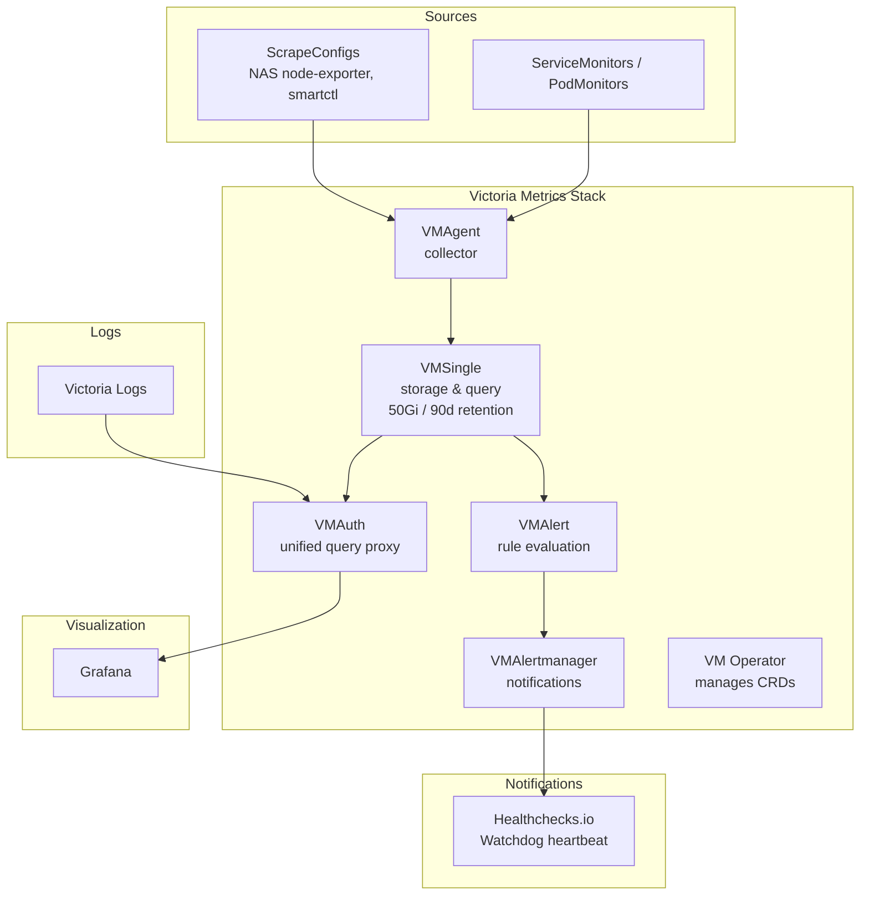
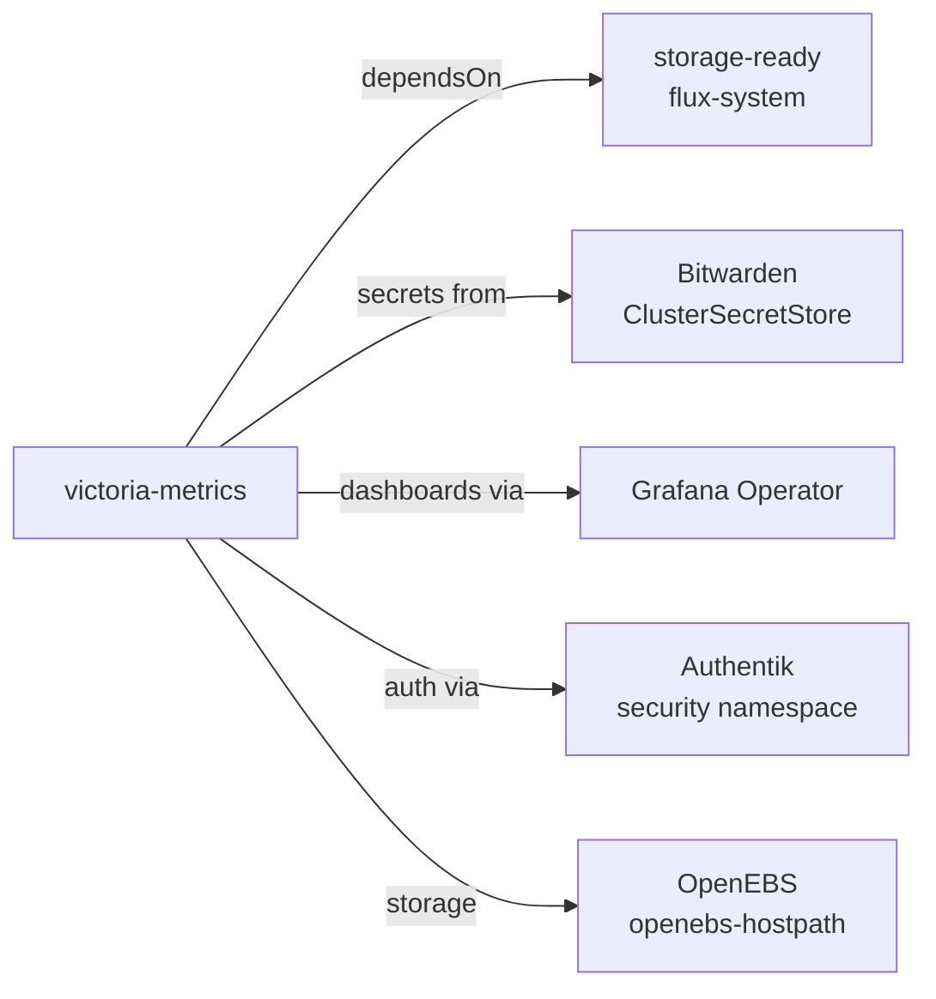

# Victoria Metrics

## Overview

Victoria Metrics is the primary metrics storage and monitoring stack for this cluster. It is deployed via the [victoria-metrics-k8s-stack](https://github.com/VictoriaMetrics/helm-charts/tree/master/charts/victoria-metrics-k8s-stack) Helm chart, which bundles multiple components into a single deployment.

Victoria Metrics provides a Prometheus-compatible time-series database with better performance and lower resource usage than Prometheus itself.

## Architecture



### Components

| Component | Purpose | Endpoint |
|-----------|---------|----------|
| **VMSingle** | Single-node time-series database | `metrics.laurivan.com` |
| **VMAgent** | Scrapes metrics from targets and remote-writes to VMSingle | Internal |
| **VMAlert** | Evaluates alerting/recording rules | `alerts.laurivan.com` |
| **VMAlertmanager** | Routes and sends alert notifications | `alertmanager.laurivan.com` |
| **VMAuth** | Authentication proxy and unified query router | Internal (port 8427) |
| **VM Operator** | Manages VM CRDs and reconciles resources | Internal |

### VMAuth Routing

VMAuth acts as a unified query endpoint that routes requests:
- `/api/v1/query.*`, `/api/v1/label/.*`, `/api/v1/series.*` → VMSingle (metrics)
- `/select/logsql/.*` → Victoria Logs (logs)

This allows Grafana to use a single datasource URL for both metrics and logs.

## Configuration

### Helm Chart

- **Chart:** `victoria-metrics-k8s-stack`
- **Source:** OCI repository (see `ocirepository.yaml`)
- **Image registry:** `quay.io`

### Storage

- **VMSingle:** 50Gi on `openebs-hostpath`, retention 90 days

### Scrape Targets

In addition to in-cluster ServiceMonitors/PodMonitors, external targets are scraped via ScrapeConfig:

| Target | Endpoint | Metrics Path |
|--------|----------|--------------|
| NAS node-exporter | `nas.servers.internal:9100` | `/metrics` |
| NAS smartctl | `nas.servers.internal:9633` | `/metrics` |

### Alerting

Alerts are routed via VMAlertmanager:

| Receiver | Purpose |
|----------|---------|
| **heartbeat** | Watchdog alert sent to healthchecks.io every 5 minutes (uptime monitoring) |
| **blackhole** | Suppresses `InfoInhibitor` alerts |

The default route sends unmatched alerts to the `heartbeat` receiver. Inhibition rules suppress warning-level alerts when a critical alert with the same name and namespace is firing.

### Custom Alert Rules

| Rule Group | Alert | Description |
|------------|-------|-------------|
| dockerhub | DockerhubRateLimitRisk | >100 containers pulling from Docker Hub |
| oom | OomKilled | Container OOMKilled ≥1 time in 10 minutes |
| btrfs | BtrfsDeviceErrorsDetected | BTRFS device errors detected |
| btrfs | BtrfsDeviceAlmostFull | BTRFS device <1% free space |

### Grafana Dashboards

Dashboards are provisioned via GrafanaDashboard CRDs using the Grafana Operator:
- Kubernetes: API Server, CoreDNS, Global, Namespaces, Nodes, Pods, Volumes, PVC
- etcd Storage
- Node Exporter Full
- Prometheus

### Ext-Auth (Authentik)

Three SecurityPolicies protect the web UIs via Authentik SSO:
- `vmsingle-victoria-metrics` → metrics UI
- `vmalert-victoria-metrics` → alerts UI
- `vmalertmanager-victoria-metrics` → alertmanager UI

## Secrets

Secrets are managed via ExternalSecrets pulling from the `bitwarden` ClusterSecretStore.

### `vmalertmanager` Secret

Created from the Bitwarden item `alertmanager`.

| Key | Description |
|-----|-------------|
| `HEALTHCHECKS_IO_HEARTBEAT_URL` | Healthchecks.io ping URL for Watchdog heartbeat (`https://hc-ping.com/<uuid>`) |

## Dependencies



| Dependency | Namespace | Purpose |
|------------|-----------|---------|
| **storage-ready** | flux-system | Ensures storage CRDs and VolSync are available |
| **openebs** | storage-system | Provides `openebs-hostpath` StorageClass for VMSingle PVC |
| **Prometheus Operator CRDs** | — | ServiceMonitor, PodMonitor, ScrapeConfig resources |
| **Grafana Operator** | observability | Dashboard provisioning via GrafanaDashboard CRs |
| **Authentik** | security | SSO protection for web UIs |
| **Bitwarden** | security | Secrets for alertmanager webhook URLs |

## Directory Structure

```
victoria-metrics/
├── app/
│   ├── helmrelease.yaml       # Main stack deployment
│   ├── ocirepository.yaml     # Chart source
│   ├── externalsecret.yaml    # Alertmanager secrets from Bitwarden
│   ├── grafanadashboard.yaml  # Operator dashboards
│   ├── scrapeconfig.yaml      # External scrape targets (NAS)
│   └── kustomization.yaml
├── app.ks.yaml                # Flux Kustomization (with ext-auth components)
├── kustomization.yaml
└── README.md
```
