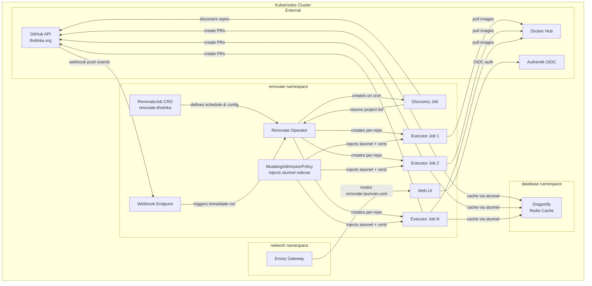
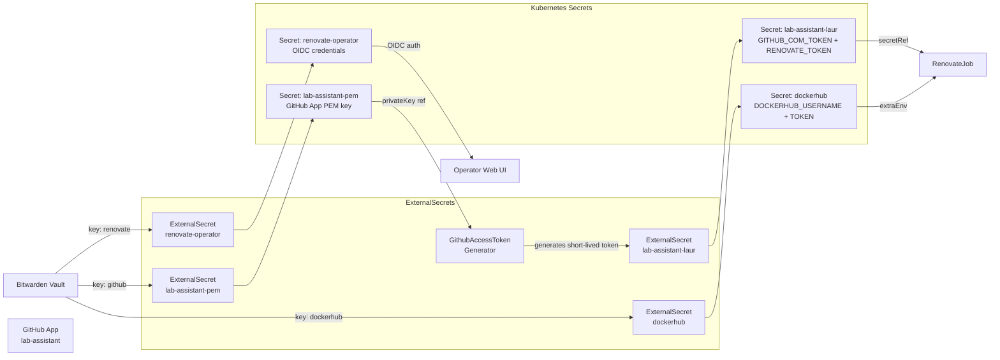

# Renovate Operator

Self-hosted, Kubernetes-native dependency update automation using the [mogenius Renovate Operator](https://github.com/mogenius/renovate-operator).

Instead of running Renovate as a standalone cron job or relying on the hosted Mend service, this operator manages Renovate executions as first-class Kubernetes workloads with CRD-based scheduling, parallel execution, auto-discovery, and a built-in web UI.

## What It Does

- **Auto-discovers** repositories in the `tholinka` GitHub organization
- **Schedules** Renovate runs via cron (hourly) using the `RenovateJob` CRD
- **Executes** up to 5 parallel Renovate jobs for discovered repositories
- **Provides** a web UI at `renovate.laurivan.com` (protected by Authentik OIDC)
- **Exposes** Prometheus metrics via ServiceMonitor and a Grafana dashboard
- **Caches** repository data in Dragonfly (Redis-compatible) via a stunnel sidecar

## Architecture



### How It Works

1. **Discovery trigger** — On the cron schedule (`0 * * * *`), the operator creates a discovery job that queries GitHub for all repos matching `tholinka/*`.
2. **Project scheduling** — Discovered projects are tracked in-cluster and scheduled for processing.
3. **Job execution** — Every 10 seconds, the operator checks for scheduled projects and spawns Renovate executor jobs (up to `parallelism: 5` concurrent).
4. **Sidecar injection** — A `MutatingAdmissionPolicy` intercepts job creation and injects a stunnel sidecar container with mTLS certificates for secure Dragonfly access.
5. **Caching** — Executor jobs use Dragonfly as a Redis-compatible cache (`RENOVATE_REDIS_URL=redis://localhost:6379` via stunnel) for repository cache and private package metadata.
6. **Webhook** — GitHub can send push/PR events to the webhook endpoint, triggering immediate Renovate runs without waiting for the next cron cycle.

## Secrets

All secrets are managed via ExternalSecrets pulling from the Bitwarden ClusterSecretStore.

### Operator Secrets (Bitwarden key: `renovate`)

| Secret Key | Purpose | Where to Get It |
|---|---|---|
| `RENOVATE_OPERATOR_CLIENT_ID` | Authentik OAuth2 client ID for the web UI | Authentik Admin → Applications → `renovate-operator` → Provider → Client ID |
| `RENOVATE_OPERATOR_CLIENT_SECRET` | Authentik OAuth2 client secret for the web UI | Authentik Admin → Applications → `renovate-operator` → Provider → Client Secret |
| `RENOVATE_OPERATOR_SESSION_SECRET` | Random string used to sign session cookies | Generate with `openssl rand -hex 32` |

### Job Secrets

#### GitHub App (Bitwarden key: `github`)

| Secret Key | Purpose | Where to Get It |
|---|---|---|
| `GITHUB_APP_PRIVATE_KEY` | PEM private key for the `lab-assistant` GitHub App | GitHub → Settings → Developer Settings → GitHub Apps → `lab-assistant` → Generate Private Key |

The private key is used by the `GithubAccessToken` generator (external-secrets) to mint short-lived installation tokens. These tokens are passed to Renovate as `RENOVATE_TOKEN` and `GITHUB_COM_TOKEN`.

- **App ID:** `3744272`
- **Install ID:** `133114754`

#### Docker Hub (Bitwarden key: `dockerhub`)

| Secret Key | Purpose | Where to Get It |
|---|---|---|
| `DOCKERHUB_USERNAME` | Docker Hub username for authenticated pulls | Docker Hub account settings |
| `DOCKERHUB_TOKEN` | Docker Hub access token (avoids rate limits) | Docker Hub → Account Settings → Security → Access Tokens → New |

These are injected as `RENOVATE_HOST_RULES` so Renovate authenticates when pulling container image metadata, avoiding Docker Hub's anonymous rate limits.

### Secret Flow



## File Structure

```
renovate-operator/
├── kustomization.yaml          # Top-level: includes app + jobs
├── app.ks.yaml                 # Flux Kustomization for the operator
├── jobs.ks.yaml                # Flux Kustomization for RenovateJob + secrets
├── app/
│   ├── kustomization.yaml
│   ├── helmrelease.yaml        # Operator Helm chart (v4.8.0)
│   ├── ocirepository.yaml      # Chart source from ghcr.io
│   ├── externalsecret.yaml     # OIDC credentials for the web UI
│   └── grafanadashboard.yaml   # Grafana dashboard
└── jobs/
    ├── kustomization.yaml
    ├── externalsecret.yaml     # GitHub App PEM, token generator, Docker Hub
    ├── renovatejob.yaml        # RenovateJob CRD (schedule, parallelism, config)
    └── mutatingadmissionpolicy.yaml  # Injects stunnel sidecar into jobs
```
