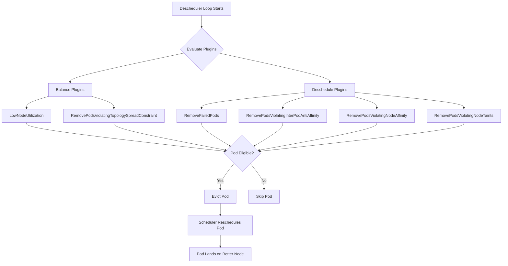
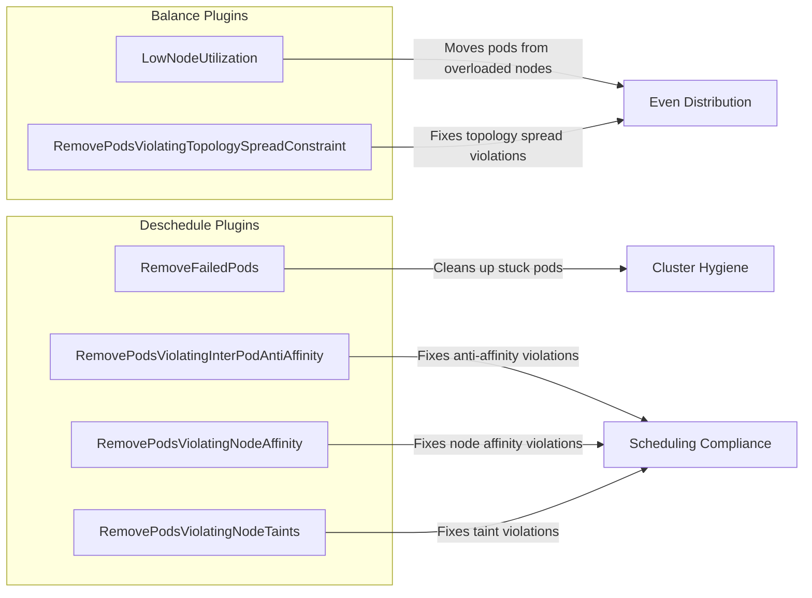
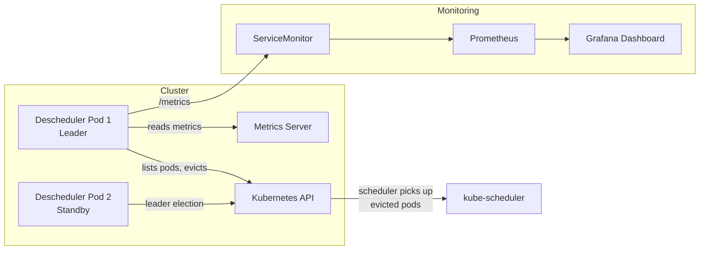

# Descheduler

The [Kubernetes Descheduler](https://github.com/kubernetes-sigs/descheduler) evicts pods that violate scheduling constraints or contribute to node imbalance, allowing the scheduler to place them on more appropriate nodes.

Unlike the scheduler (which only acts at pod creation time), the descheduler continuously re-evaluates running pods and corrects drift caused by node additions, taint changes, or shifting resource usage.

## How It Works



## Current Configuration

This cluster runs the descheduler as a **Deployment with 2 replicas** (leader election enabled) using chart version `0.34.0` and the `v1alpha2` policy API.

### Profile: Default

The profile uses the `DefaultEvictor` with protections disabled for:
- `FailedBarePods` — allows evicting failed bare pods
- `PodsWithLocalStorage` — allows evicting pods using local storage
- `SystemCriticalPods` — allows evicting system-critical pods

### Active Plugins



#### LowNodeUtilization

Balances resource usage across nodes using **Kubernetes Metrics** (metrics-server).

| Metric | Threshold (underutilized) | Target (overutilized) |
|--------|--------------------------|----------------------|
| CPU    | < 20%                    | > 50%               |
| Memory | < 20%                    | > 75%               |
| Pods   | < 20                     | > 50                |

Pods are moved from nodes exceeding target thresholds to nodes below the underutilization thresholds.

#### RemoveFailedPods

Evicts pods that have been in a failed state for more than **30 minutes** (`minPodLifetimeSeconds: 1800`) with these specific failure reasons:
- `ContainerStatusUnknown`
- `NodeAffinity`
- `NodeShutdown`
- `Terminated`
- `UnexpectedAdmissionError`

Includes init containers in the check. Excludes pods owned by `Job` resources (to avoid interfering with job retry logic).

#### RemovePodsViolatingNodeAffinity

Evicts pods whose `requiredDuringSchedulingIgnoredDuringExecution` node affinity rules are no longer satisfied (e.g., after a node label change).

#### RemovePodsViolatingNodeTaints

Evicts pods that no longer tolerate the taints on their current node.

#### RemovePodsViolatingInterPodAntiAffinity

Evicts pods that violate inter-pod anti-affinity rules.

#### RemovePodsViolatingTopologySpreadConstraint

Evicts pods to restore compliance with `topologySpreadConstraints`.

## Architecture



## Best Practices

### Pod Disruption Budgets

Always define `PodDisruptionBudgets` (PDBs) for critical workloads. The descheduler respects PDBs — it will not evict a pod if doing so would violate the budget.

```yaml
apiVersion: policy/v1
kind: PodDisruptionBudget
metadata:
  name: my-app
spec:
  minAvailable: 1
  selector:
    matchLabels:
      app: my-app
```

### Prioritize Workloads

Use `PriorityClasses` to protect important workloads. The `DefaultEvictor` skips pods with `system-cluster-critical` and `system-node-critical` priority classes by default (though this cluster has that protection disabled).

### Avoid Eviction Storms

- Set reasonable thresholds in `LowNodeUtilization` — too aggressive and you'll see constant pod churn
- The current config uses conservative thresholds (20% low / 50-75% high) which is a good balance
- Monitor the Grafana dashboard for eviction spikes

### Label Critical Pods

Add annotations to prevent eviction of specific pods:

```yaml
metadata:
  annotations:
    descheduler.alpha.kubernetes.io/evict: "false"
```

### Topology Spread Constraints

When using `RemovePodsViolatingTopologySpreadConstraint`, ensure your deployments define meaningful topology spread:

```yaml
topologySpreadConstraints:
  - maxSkew: 1
    topologyKey: kubernetes.io/hostname
    whenUnsatisfiable: DoNotSchedule
    labelSelector:
      matchLabels:
        app: my-app
```

### Monitoring

The deployment includes a `ServiceMonitor` for Prometheus scraping. Key metrics to watch:

| Metric | Description |
|--------|-------------|
| `descheduler_pods_evicted_total` | Counter of evicted pods by result, strategy, namespace, node |
| `descheduler_loop_duration_seconds` | Time for a full descheduling cycle |
| `descheduler_strategy_duration_seconds` | Time per strategy execution |

A Grafana dashboard is included in `app/grafanadashboard.yaml` showing eviction rates, strategy breakdowns, and performance metrics.

### Tuning Tips

1. **Start conservative** — begin with high target thresholds and lower them gradually
2. **Watch for flapping** — if the same pods keep getting evicted and rescheduled to the same node, your thresholds may be too tight
3. **Exclude namespaces** — consider excluding `kube-system` or other critical namespaces if evictions cause issues
4. **Failed pod cleanup** — the 30-minute lifetime threshold prevents evicting pods that might recover on their own
5. **Leader election** — running 2 replicas ensures high availability without duplicate evictions
